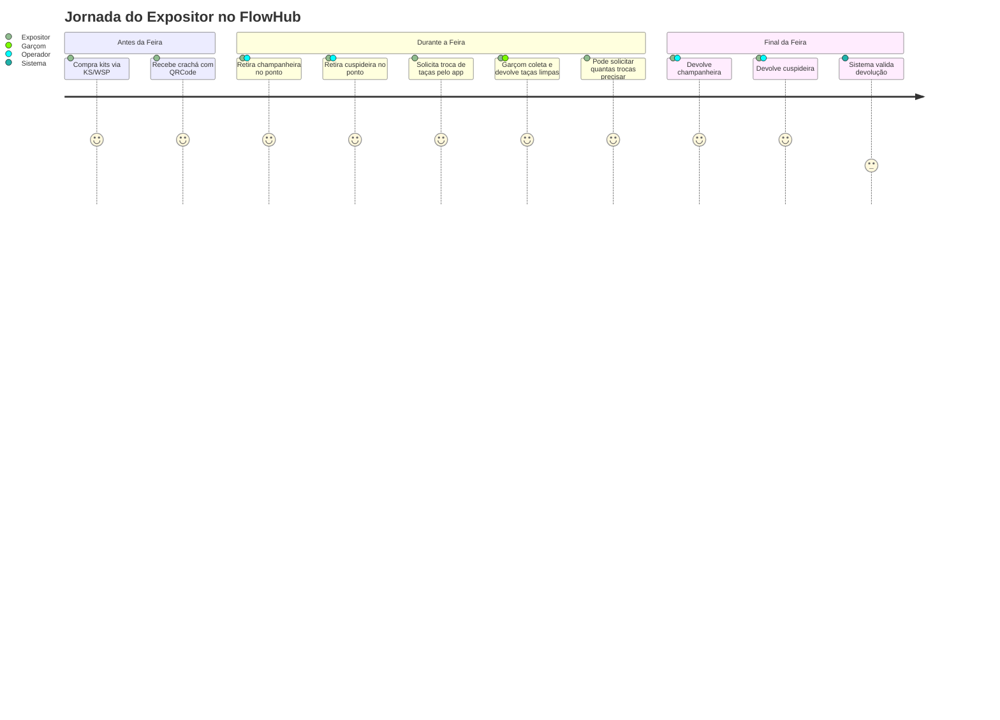
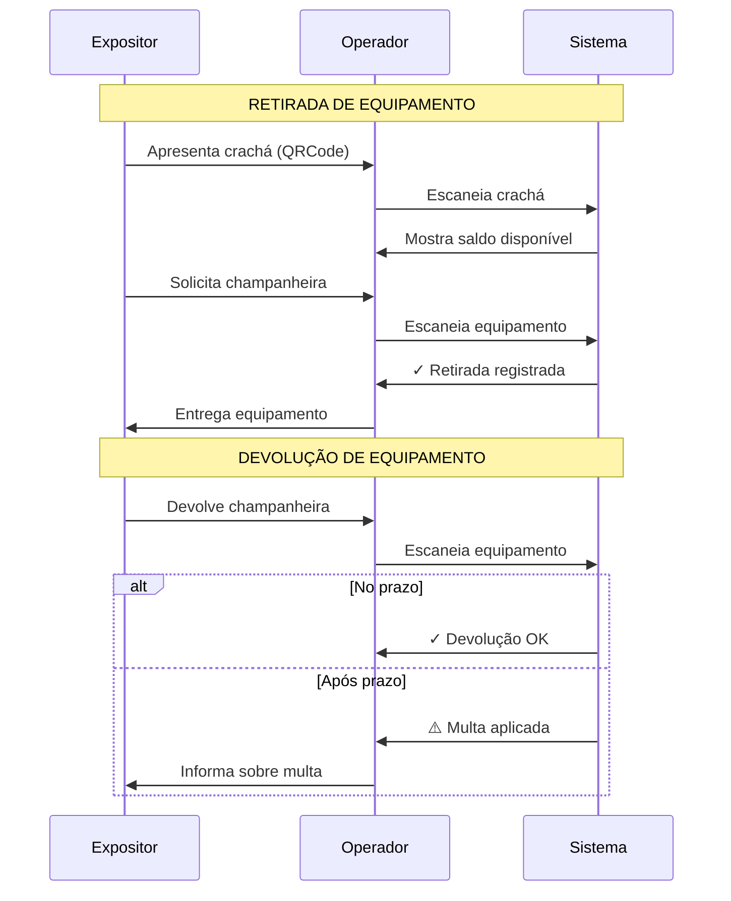
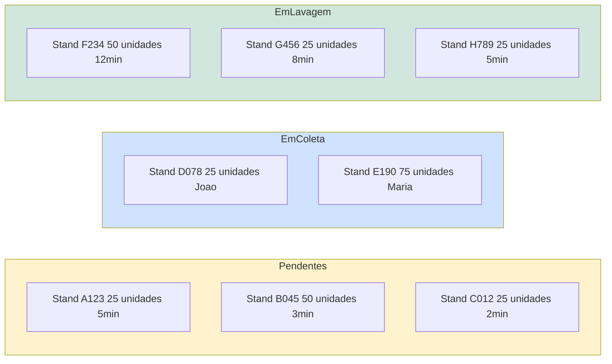
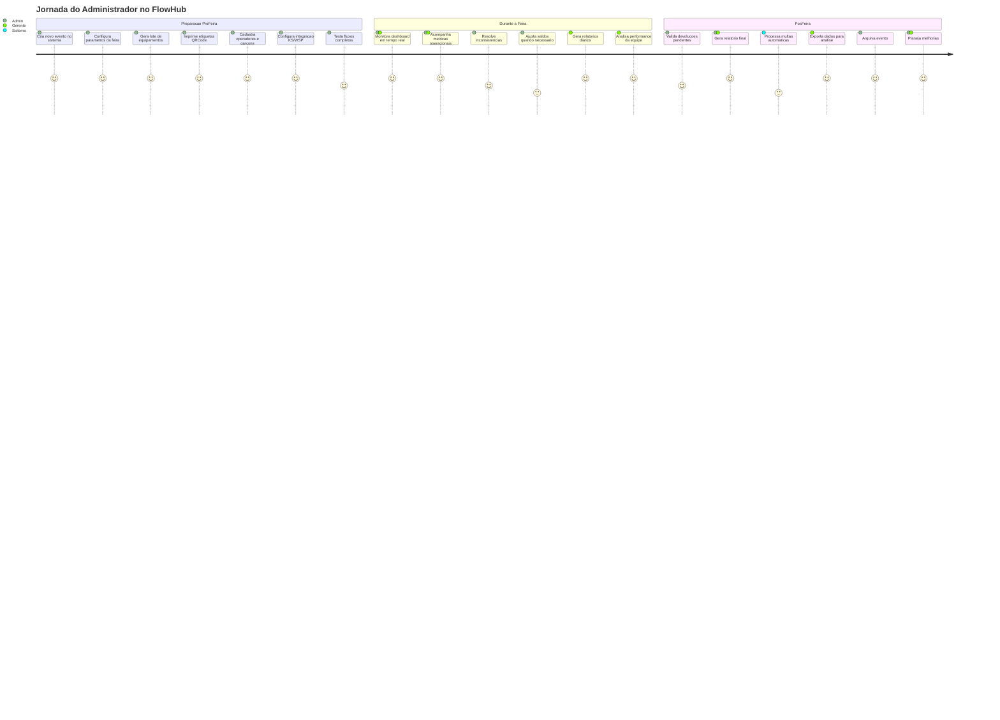
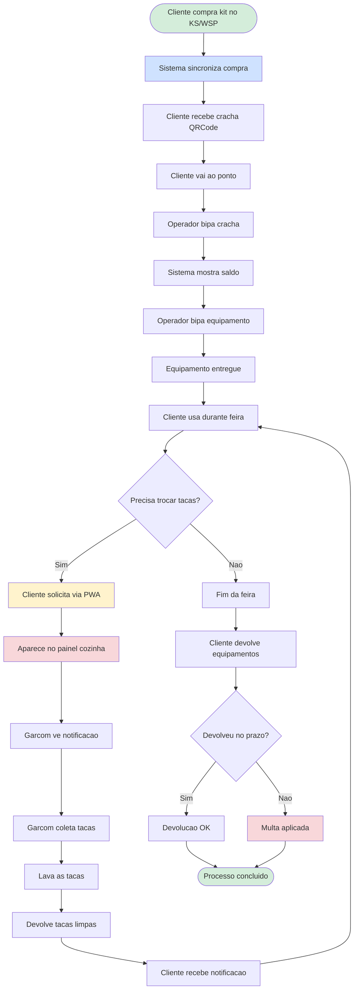

# FlowHub - Apresentação para Cliente

## Visão Geral

Sistema completo para gestão de locação de taças e equipamentos em feiras de vinho, oferecendo controle em tempo real, automação de processos e experiência otimizada para todos os envolvidos.

### O que o FlowHub Resolve?

- ✅ Controle automatizado de compras de kits (integração com KS/WSP)
- ✅ Gestão de retirada e devolução de equipamentos (champanheiras e cuspideiras)
- ✅ Solicitações de reposição de taças em tempo real
- ✅ Painel de cozinha para otimizar o fluxo de lavagem
- ✅ Rastreabilidade completa via QRCode
- ✅ Prevenção de perdas com sistema de multas automáticas
- ✅ Relatórios gerenciais e operacionais

---

## Personas e Suas Jornadas

> O sistema possui 4 personas principais com interfaces dedicadas: **Expositor**, **Operador**, **Cozinha** e **Administrador**. Garçons e gerentes são perfis de usuário que utilizam as interfaces existentes.

### 1. Expositor (Cliente da Feira)

**Quem é:** Empresas vinícolas que expõem seus produtos na feira FlowHub.

**O que compra:** Kits de serviço (1 kit = 25 taças + 1 champanheira + 1 cuspideira)

#### Jornada do Expositor

#### Funcionalidades Disponíveis (PWA)

**Dashboard**
- Resumo de kits comprados
- Equipamentos retirados e disponíveis
- Solicitações de reposição ativas
- Alertas de equipamentos não devolvidos

**Solicitar Reposição de Taças**
- Botão rápido: "Solicitar troca de taças"
- Seleção de quantidade (25, 50, 75, 100...)
- Ilimitado durante o evento
- Notificação quando taças estiverem prontas

**Meus Equipamentos**
- Lista de champanheiras e cuspideiras retiradas
- Status de cada equipamento
- Alerta visual se próximo da multa
- Lembrete de devolução

**Histórico de Lavagens**
- Quantas vezes solicitou reposição
- Total de taças lavadas
- Tempo médio de atendimento
- Avaliação do serviço

#### Benefícios para o Expositor

- 📱 **Praticidade**: Solicita reposição direto do stand pelo celular
- ⚡ **Agilidade**: Notificação em tempo real quando taças estão prontas
- 🔔 **Sem Preocupação**: Alertas automáticos sobre devoluções pendentes
- 📊 **Transparência**: Acompanha todo o histórico de serviços
- 🇺🇸 **Internacional**: Sistema disponível em português e inglês

---

### 2. Operador (Ponto de Retirada)

**Quem é:** Funcionário responsável pelos pontos de retirada e devolução de equipamentos.

**O que faz:** Gerencia a entrega e devolução de champanheiras e cuspideiras.

#### Jornada do Operador

#### Funcionalidades Disponíveis (PWA)

**Scanner QRCode**
- Câmera sempre disponível
- Escaneamento rápido e preciso
- Feedback visual e sonoro

**Retirada de Equipamento**
- Bipar crachá do cliente
- Sistema mostra saldo disponível
- Bipar equipamento escolhido
- Confirmação instantânea

**Devolução de Equipamento**
- Bipar equipamento devolvido
- Sistema verifica automaticamente se está atrasado
- Multa aplicada automaticamente se necessário
- Comprovante de devolução

**Consulta de Cliente**
- Busca por QRCode, CNPJ ou nome
- Visualiza histórico completo
- Equipamentos pendentes de devolução

#### Benefícios para o Operador

- 🚀 **Rapidez**: Processo de retirada em menos de 30 segundos
- ✅ **Sem Erros**: Sistema valida automaticamente saldo disponível
- 📋 **Organização**: Todo histórico registrado automaticamente
- 💰 **Automação**: Multas calculadas e aplicadas automaticamente
- 📱 **Mobilidade**: Opera direto do celular/tablet

---

### 3. Cozinha (Painel de Lavagem + Gestão de Garçons)

**Quem é:** Equipe responsável pela supervisão do processo de lavagem na área da cozinha, incluindo supervisores e garçons.

**O que faz:** Monitora o fluxo de solicitações, atribui tarefas aos garçons e garante eficiência no processo.

#### Visualização do Painel

#### Funcionalidades Disponíveis (PWA)

**Painel em Tempo Real**
- Visualização tipo kanban
- Status: Pendente → Em Coleta → Em Lavagem → Concluído
- Cores indicando prioridade
- Atualização automática via WebSocket

**Filtros e Busca**
- Por status
- Por stand
- Por garçom responsável
- Por tempo de espera

**Métricas em Tempo Real**
- Total de solicitações ativas
- Tempo médio de atendimento
- Taxa de conclusão por hora
- Picos de demanda

**Alertas**
- Solicitação aguardando mais de 15 minutos
- Acúmulo de tarefas pendentes
- Performance abaixo da média

**Gestão de Garçons** (no mesmo painel)
- Atribuir solicitações para garçons
- Ver quais garçons estão disponíveis
- Acompanhar performance individual
- Histórico de tarefas por garçom

**Funcionalidades para Garçons** (usando o mesmo painel)
- Ver solicitações atribuídas a mim
- Marcar como "Coletado no stand"
- Marcar como "Lavagem concluída"
- Ver meu histórico e performance

#### Benefícios para a Cozinha e Garçons

- 👀 **Visibilidade Total**: Supervisores e garçons veem todo o fluxo em tempo real
- 📊 **Métricas**: Acompanha performance e identifica gargalos
- 🚨 **Alertas**: Notificações quando algo precisa de atenção
- 📈 **Otimização**: Dados para melhorar processos
- 🔄 **Atualização Automática**: Sem necessidade de refresh manual
- 🎯 **Foco**: Garçons veem apenas suas tarefas, supervisores veem tudo

---

### 4. Administrador

**Quem é:** Responsável pela configuração, gestão do sistema e análise estratégica. Inclui perfis administrativos e gerenciais.

**O que faz:** Configura eventos, gera equipamentos, imprime etiquetas, gerencia usuários e monitora KPIs estratégicos.

#### Jornada do Administrador

#### Funcionalidades Disponíveis (PWA)

**Gerenciar Eventos**
- Criar novo evento (nome, datas, local)
- Configurar parâmetros (valor de multa, pontos de retirada)
- Ativar/desativar evento
- Traduzir informações (PT/EN)

**Gerenciar Clientes**
- CRUD completo de clientes
- Sincronização com Sistema Externo
- Ajuste manual de saldos (casos especiais)
- Visualizar histórico completo

**Gerenciar Equipamentos**
- Gerar lote de equipamentos
- Definir pontos de retirada
- Marcar como manutenção
- Dar baixa em equipamentos

**Geração de Etiquetas**
- Gerar etiquetas de equipamentos em PDF
- Formato A4, 6 etiquetas por página
- QRCode + Código de barras
- Layout personalizado por tipo

**Relatórios Administrativos**
- Log de operações
- Auditoria de ações
- Inconsistências detectadas
- Performance do sistema

**Gestão de Usuários**
- Criar operadores, garçons, gerentes
- Definir permissões por perfil
- Associar a eventos específicos
- Ativar/desativar acesso

**Relatórios Gerenciais** (para perfil Gerente)
- Dashboard executivo com KPIs financeiros
- Faturamento por dia
- Performance de garçons e operadores
- Taxa de utilização de equipamentos
- Análise de picos de demanda
- Métricas de satisfação (NPS, avaliações)
- Comparativo entre eventos

#### Benefícios para Administradores e Gerentes

- ⚙️ **Configuração Flexível**: Adapta sistema para cada evento
- 🏷️ **Automação**: Gera etiquetas em lote automaticamente
- 👥 **Gestão Centralizada**: Todos os usuários em um só lugar
- 🔍 **Auditoria**: Rastreabilidade completa de ações
- 🔒 **Segurança**: Controle granular de permissões
- 📊 **Visão Estratégica** (Gerentes): KPIs e relatórios executivos
- 💼 **Tomada de Decisão**: Dados em tempo real para decisões estratégicas

---

## Diferenciais da Solução

### 1. Integração Automática com Sistema de Vendas

- ✅ Sincronização em tempo real com Sistema Externo de Vendas
- ✅ Atualização automática de saldos
- ✅ Redução de erros manuais

### 2. Controle Inteligente de Equipamentos

- ✅ Rastreabilidade 100% via QRCode
- ✅ Multas aplicadas automaticamente
- ✅ Alertas preventivos de não devolução
- ✅ Histórico completo de uso

### 3. Reposição de Taças Ilimitada

- ✅ Expositor solicita quantas vezes precisar
- ✅ Sempre em múltiplos de 25 taças
- ✅ Notificações em tempo real
- ✅ Rastreamento do tempo de atendimento

### 4. Painel de Cozinha em Tempo Real

- ✅ Visibilidade total do fluxo
- ✅ Priorização automática por tempo de espera
- ✅ Alertas de gargalos
- ✅ Otimização do processo de lavagem

### 5. Experiência Mobile-First

- ✅ PWA instalável em qualquer dispositivo
- ✅ Funciona offline (modo degradado)
- ✅ Interface intuitiva e responsiva
- ✅ Scanner de QRCode integrado

### 6. Multilíngue

- ✅ Português (padrão)
- ✅ Inglês
- ✅ Fácil adicionar novos idiomas
- ✅ Detecção automática do navegador

### 7. Relatórios e Analytics

- ✅ Dashboards em tempo real
- ✅ Exportação em PDF/Excel
- ✅ Análise de tendências
- ✅ Comparativo entre eventos

---

## Fluxo Completo do Sistema

---

## Benefícios Gerais do Sistema

### Para o Negócio FlowHub

- 💰 **Receita Garantida**: Controle automático de multas por não devolução
- 📊 **Dados Estratégicos**: Relatórios completos para decisões futuras
- ⚡ **Eficiência Operacional**: Redução de 70% no tempo de processos manuais
- 😊 **Satisfação do Cliente**: Atendimento rápido e notificações em tempo real
- 🌍 **Alcance Internacional**: Sistema em múltiplos idiomas
- 📈 **Escalabilidade**: Suporta múltiplos eventos simultaneamente no futuro

### Para os Expositores

- 🎯 **Foco no Negócio**: Menos preocupação com logística de taças
- ⚡ **Rapidez**: Solicita reposição em segundos
- 📱 **Praticidade**: Tudo pelo celular
- 🔔 **Transparência**: Acompanha tudo em tempo real
- 💯 **Sem Limites**: Pode trocar taças quantas vezes precisar

### Para a Equipe Operacional

- 🚀 **Agilidade**: Processos automatizados
- ✅ **Precisão**: Zero erros de controle manual
- 📋 **Organização**: Histórico completo de operações
- 📱 **Mobilidade**: Opera de qualquer lugar
- 🎯 **Clareza**: Sabe exatamente o que fazer

---

## Investimento e Custos Mensais

### Infraestrutura Azure (Produção)

| Recurso | Especificação | Custo Mensal (USD) |
|---------|--------------|-------------------|
| App Service | P1V2 (API Backend) | ~$75 |
| MongoDB Atlas | M10 Cluster | ~$60 |
| Redis Cache | C1 (Cache distribuído) | ~$45 |
| Azure Functions | Consumption Plan | ~$10 |
| Application Insights | Monitoramento | ~$20 |
| Azure Service Bus | Basic Tier | ~$10 |
| Static Web Apps | PWA Hosting | ~$9 |
| **TOTAL** | | **~$230/mês** |

### Licenças

- ✅ .NET 8: **Gratuito**
- ✅ MongoDB Community: **Gratuito**
- ✅ KeyCloak: **Open Source** (auto-hospedado ou cloud)

### Desenvolvimento

- Estimativa baseada em escopo completo
- Arquitetura alinhada com projeto existente (Automação Cotações)
- Desenvolvimento iterativo em sprints de 2 semanas
- Inclui: Backend, PWA, Integração KS/WSP, Testes, Deploy

---

## Próximos Passos

### Fase 1: Validação e Design (2 semanas)
- ✅ Aprovação do desenho de solução
- ✅ Criação de protótipos de interface (Figma)
- ✅ Definição do contrato de integração KS/WSP
- ✅ Validação de fluxos com stakeholders

### Fase 2: MVP (6-8 semanas)
- Desenvolvimento do backend (.NET 8)
- Desenvolvimento do PWA (4 módulos: Expositor, Operador, Cozinha, Administrador)
- Integração com KS/WSP
- Geração de QRCodes e etiquetas
- Testes unitários e integração

### Fase 3: Homologação (2 semanas)
- Testes com usuários reais
- Ajustes de UX/UI
- Testes de carga
- Treinamento da equipe

### Fase 4: Go-Live (1 semana)
- Deploy em produção
- Monitoramento 24/7
- Suporte dedicado
- Ajustes rápidos

---

## Contato

Para mais informações ou demonstração:

📧 Email: [seu-email]
📱 WhatsApp: [seu-telefone]
🌐 Website: [seu-site]

---

**FlowHub** - Transformando a gestão de eventos vitivinícolas com tecnologia e inovação.
