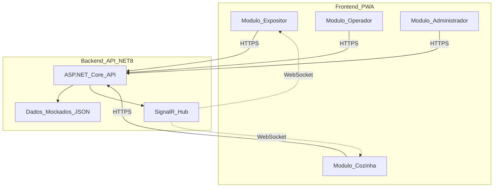
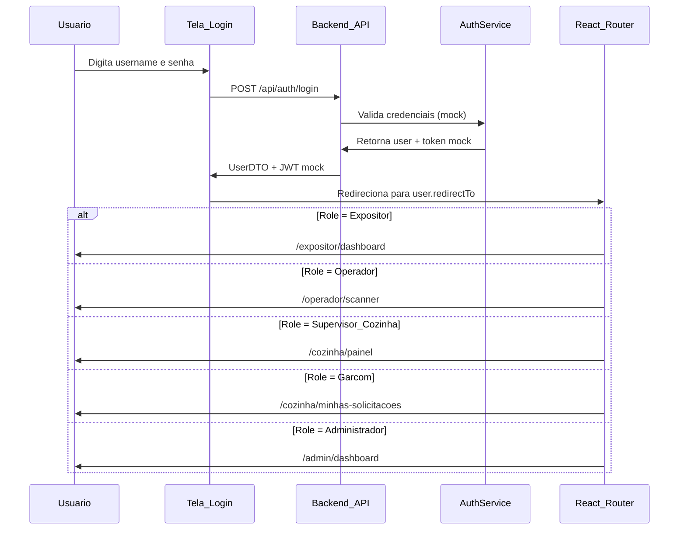

# FlowHub - Plano POC (Proof of Concept)

## Objetivo

Criar uma versão demonstrativa do FlowHub para validação do cliente, focada em **experiência visual e fluxos principais**, sem complexidade de integrações e infraestrutura completa.

---

## 1. Escopo da POC

### O que ENTRA (Funcionalidades Core)

**✅ 4 Interfaces PWA Funcionais:**

- Expositor: Dashboard, solicitar reposição de taças, ver equipamentos
- Operador: Scanner QR (simulado), registrar retirada/devolução
- Cozinha: Painel kanban em tempo real, atribuir garçons
- Administrador: Gerenciar eventos, clientes, equipamentos, gerar etiquetas

**✅ Dados Mockados:**

- 1 evento pré-configurado (FlowHub 2026)
- 10-15 clientes fictícios com kits comprados
- 50 equipamentos (champanheiras/cuspideiras) com QRCodes
- 20-30 solicitações de reposição em diferentes status
- 5 usuários (1 de cada perfil + garçons)

**✅ Funcionalidades Simplificadas:**

- Autenticação mockada (select de usuário, sem senha)
- SignalR para notificações em tempo real (entre as telas abertas)
- Scanner QR simulado (botão "Simular Scan" + dropdown de equipamentos)
- Geração de etiquetas PDF (QRCode + código de barras)
- Internacionalização PT/EN (troca de idioma funcional)

### ❌ O que FICA DE FORA (para versão completa)

- ❌ Integração com sistema externo (KS/WSP)
- ❌ KeyCloak / OAuth2 (login real com senha)
- ❌ Azure Functions / Service Bus
- ❌ Persistência em MongoDB (dados em memória ou JSON local)
- ❌ Redis / Cache distribuído
- ❌ CI/CD pipeline
- ❌ Testes automatizados
- ❌ Scanner QR real via câmera (apenas simulado)
- ❌ Email / notificações push externas
- ❌ Relatórios avançados / exportação

---

## 2. Arquitetura Simplificada da POC



### Stack Técnica POC

**Backend:**

- .NET 8.0 Web API (ASP.NET Core)
- SignalR (notificações tempo real)
- Dados em memória (Dictionary/List) ou JSON files
- QRCoder (geração de QRCodes)
- iTextSharp/QuestPDF (geração de PDFs)

**Frontend:**

- React 18+ (SPA)
- Vite (build tool rápido)
- React Router (navegação entre módulos)
- TailwindCSS + shadcn/ui ou Material-UI (componentes prontos)
- @microsoft/signalr (cliente WebSocket)
- react-qr-code (exibir QRCodes)
- react-i18next (internacionalização PT/EN)
- Axios (requisições HTTP)
- React Hook Form (formulários)
- Zustand ou Context API (gerenciamento de estado)

**Hospedagem POC:**

- Backend: Azure App Service (Free/Basic tier)
- Frontend: Azure Static Web Apps (Free tier) ou Vercel/Netlify
- **Total: ~$0-10/mês**

---

## 3. Estrutura de Dados Mockados

### 3.1 Arquivo: `MockData.json`

```json
{
  "events": [
    {
      "id": "evt-001",
      "name": "FlowHub 2026",
      "code": "PW2026",
      "startDate": "2026-03-15",
      "endDate": "2026-03-18",
      "location": "Expo Center Norte - São Paulo",
      "status": "Active"
    }
  ],
  "customers": [
    {
      "id": "cust-001",
      "cnpj": "12345678000190",
      "companyName": "Vinícola Aurora",
      "standNumber": "A123",
      "purchasedKitsQuantity": 3,
      "availableChampagneQuantity": 3,
      "pickedUpChampagneQuantity": 2,
      "availableSpittoonQuantity": 3,
      "pickedUpSpittoonQuantity": 1,
      "badgeQRCode": "BADGE-001"
    }
    // ... mais 9-14 clientes
  ],
  "equipments": [
    {
      "id": "equip-001",
      "equipmentNumber": "CHAMP-001",
      "type": "Champagne",
      "qrCode": "QR-CHAMP-001",
      "status": "Available"
    }
    // ... mais 49 equipamentos
  ],
  "serviceRequests": [
    {
      "id": "sr-001",
      "customerId": "cust-001",
      "standNumber": "A123",
      "requestedGlassQuantity": 25,
      "status": "Pending",
      "requestedAt": "2026-03-16T10:30:00Z"
    }
    // ... mais 19-29 solicitações
  ],
  "users": [
    {
      "id": "user-001",
      "username": "expositor",
      "password": "123456",
      "name": "João Silva",
      "email": "joao.silva@vinicolaaurora.com.br",
      "role": "Expositor",
      "permissions": ["view_dashboard", "request_service", "view_equipments"],
      "customerId": "cust-001",
      "redirectTo": "/expositor/dashboard"
    },
    {
      "id": "user-002",
      "username": "operador",
      "password": "123456",
      "name": "Maria Santos",
      "email": "maria.santos@FlowHub.com",
      "role": "Operador",
      "permissions": ["scan_qrcode", "register_pickup", "register_return"],
      "redirectTo": "/operador/scanner"
    },
    {
      "id": "user-003",
      "username": "supervisor",
      "password": "123456",
      "name": "Carlos Pereira",
      "email": "carlos.pereira@FlowHub.com",
      "role": "Supervisor_Cozinha",
      "permissions": ["view_all_requests", "assign_waiter", "manage_kitchen"],
      "redirectTo": "/cozinha/painel"
    },
    {
      "id": "user-004",
      "username": "garcom",
      "password": "123456",
      "name": "Ana Costa",
      "email": "ana.costa@FlowHub.com",
      "role": "Garcom",
      "permissions": ["view_my_requests", "update_request_status"],
      "redirectTo": "/cozinha/minhas-solicitacoes"
    },
    {
      "id": "user-005",
      "username": "admin",
      "password": "123456",
      "name": "Roberto Admin",
      "email": "roberto.admin@FlowHub.com",
      "role": "Administrador",
      "permissions": ["manage_events", "manage_customers", "manage_equipments", "manage_users", "generate_labels"],
      "redirectTo": "/admin/dashboard"
    }
  ]
}
```

### 3.2 Autenticação Mockada (Simulando KeyCloak)

#### Fluxo de Login



#### Credenciais de Teste POC

| Username | Senha | Role | Redireciona para |

|----------|-------|------|------------------|

| `expositor` | `123456` | Expositor | `/expositor/dashboard` |

| `operador` | `123456` | Operador | `/operador/scanner` |

| `supervisor` | `123456` | Supervisor_Cozinha | `/cozinha/painel` |

| `garcom` | `123456` | Garcom | `/cozinha/minhas-solicitacoes` |

| `admin` | `123456` | Administrador | `/admin/dashboard` |

#### Token JWT Mockado

```json
{
  "sub": "user-001",
  "name": "João Silva",
  "email": "joao.silva@vinicolaaurora.com.br",
  "role": "Expositor",
  "permissions": ["view_dashboard", "request_service", "view_equipments"],
  "customerId": "cust-001",
  "exp": 1735689600,
  "iat": 1735603200
}
```

**Importante:** Na POC, o token é gerado no backend mas não é validado criptograficamente. Na versão final, o KeyCloak gerará tokens reais com assinatura digital.

---

## 4. Funcionalidades por Módulo (POC)

### 4.0 Tela de Login (Comum a Todos)

**Tela Única de Login**

- Logo FlowHub
- Campos: Username e Senha
- Seletor de idioma (PT/EN) no canto superior direito
- Botão "Entrar"
- Link "Credenciais de teste" (abre modal com tabela de usuários)

**Após Login:**

- Sistema valida credenciais mockadas
- Gera token JWT mockado
- Armazena token no localStorage
- Redireciona automaticamente baseado no `role`:
  - Expositor → `/expositor/dashboard`
  - Operador → `/operador/scanner`
  - Supervisor → `/cozinha/painel`
  - Garçom → `/cozinha/minhas-solicitacoes`
  - Admin → `/admin/dashboard`

### 4.1 Módulo Expositor

**Dashboard**

- Cards resumo: Kits comprados (3), Equipamentos retirados (3/6), Solicitações ativas (2)
- Botão destacado: "Solicitar Reposição de Taças"
- Lista de solicitações recentes (status, tempo de espera)
- Alertas: "1 equipamento próximo do prazo de devolução"

**Tela 3: Solicitar Reposição**

- Dropdown quantidade: 25, 50, 75, 100 taças
- Textarea opcional: observações
- Botão "Solicitar"
- Após envio: notificação "Solicitação enviada!" + atualiza dashboard

**Tela 4: Meus Equipamentos**

- Tabela: Tipo, Número, Data retirada, Status
- Badge visual: "No prazo" (verde), "Atenção" (amarelo), "Atrasado" (vermelho)

### 4.2 Módulo Operador

**Scanner QR (Simulado)**

- Botão grande: "Simular Scan de Crachá"
- Modal abre com dropdown de clientes mockados
- Ao selecionar: mostra dados do cliente + saldo de equipamentos

**Registrar Retirada**

- Após scan do crachá, botão "Registrar Retirada de Equipamento"
- Dropdown: tipo (Champanheira/Cuspideira) + número do equipamento
- Botão "Confirmar Retirada"
- Feedback: "Equipamento CHAMP-001 retirado por Vinícola Aurora"

**Registrar Devolução**

- Botão "Simular Scan de Equipamento"
- Dropdown com equipamentos retirados
- Sistema verifica prazo automaticamente
- Se atrasado: modal "Multa de R$ 50,00 aplicada"
- Botão "Confirmar Devolução"

### 4.3 Módulo Cozinha

**Painel Kanban (Tempo Real)** *(Visão Supervisor)*

- 4 colunas: Pendente (8), Em Coleta (3), Em Lavagem (5), Concluído (10 hoje)
- Cards com: Stand, Quantidade, Tempo de espera, Garçom atribuído
- Cores: Vermelho (>15min), Amarelo (10-15min), Verde (<10min)
- **SignalR**: atualiza automaticamente quando novo pedido é criado

**Atribuir Solicitação** *(Supervisor)*

- Click no card pendente
- Modal: Dropdown com garçons disponíveis
- Botão "Atribuir para [Nome]"
- SignalR notifica o garçom

**Minhas Solicitações** *(Visão Garçom)*

- Lista apenas "Minhas Solicitações"
- Botões: "Coletado" → "Concluído"
- Timer de performance individual

### 4.4 Módulo Administrador

**Dashboard Admin**

- Tabs: Eventos, Clientes, Equipamentos, Etiquetas, Usuários

**Gerenciar Evento**

- Formulário: Nome, Código, Datas, Local
- Botão "Salvar" (salva em memória)

**Gerenciar Clientes**

- Tabela: CNPJ, Nome, Stand, Kits comprados
- Botões: Adicionar, Editar (modal), Excluir
- Filtro por nome/CNPJ

**Gerenciar Equipamentos**

- Botão "Gerar Lote de Equipamentos"
- Modal: Quantidade, Tipo (Champanheira/Cuspideira)
- Sistema gera IDs sequenciais + QRCodes

**Gerar Etiquetas**

- Dropdown: Selecionar equipamentos (multi-select)
- Botão "Gerar PDF"
- Download de PDF A4 com 6 etiquetas/página
- Cada etiqueta: QRCode + Código de barras + Número

---

## 5. Fluxo de Demonstração (Script)

**Cenário: Demonstração completa com todos os perfis**

### Preparação (antes da demo)

1. Abrir 5 abas do navegador
2. **Aba 1**: Login como `expositor` / `123456`
3. **Aba 2**: Login como `supervisor` / `123456`
4. **Aba 3**: Login como `garcom` / `123456`
5. **Aba 4**: Login como `operador` / `123456`
6. **Aba 5**: Login como `admin` / `123456`

Cada aba redireciona automaticamente para o módulo correto.

### Ato 1: Expositor solicita reposição (2 min)

1. **[Aba 1 - Expositor]** Já está no dashboard após login
2. Dashboard mostra: 3 kits, 3 equipamentos retirados, 1 solicitação ativa
3. Click "Solicitar Reposição" → Selecionar 50 taças → Enviar
4. Notificação: "Solicitação enviada!"
5. Dashboard atualiza: agora 2 solicitações ativas

### Ato 2: Cozinha recebe em tempo real (1 min)

1. **[Aba 2 - Supervisor]** Painel Cozinha já aberto
2. **SignalR**: Novo card aparece automaticamente na coluna "Pendente"
3. Card mostra: "Stand A123 - 50 taças - 0 min"
4. Supervisor click no card → Atribui para "Ana Costa (Garçom)"

### Ato 3: Garçom vê sua tarefa (1 min)

1. **[Aba 3 - Garçom]** Tela "Minhas Solicitações" já aberta
2. **SignalR**: Notificação "Nova solicitação atribuída!"
3. Lista atualiza: "Stand A123 - 50 taças"
4. Click "Coletado" → status muda para "Em Coleta"
5. Após 30s, click "Concluído" → status "Concluído"

### Ato 4: Expositor é notificado (30s)

1. **[Volta para Aba 1 - Expositor]**
2. **SignalR**: Notificação "Suas taças estão prontas!"
3. Dashboard atualiza: solicitação mudou para "Concluída"

### Ato 5: Operador registra devolução (1 min)

1. **[Aba 4 - Operador]** Scanner já aberto
2. Click "Simular Scan Equipamento" → Seleciona "CHAMP-001"
3. Sistema mostra: Cliente "Vinícola Aurora", retirado há 2 dias
4. Botão "Confirmar Devolução" → Sucesso!

### Ato 6: Admin gera etiquetas (1 min)

1. **[Aba 5 - Admin]** Dashboard Admin já aberto
2. Tab "Equipamentos" → Botão "Gerar Lote"
3. Modal: 10 Champanheiras → "Gerar"
4. Sistema cria 10 equipamentos com QRCodes
5. Tab "Etiquetas" → Seleciona os 10 novos → "Gerar PDF"
6. Download PDF com etiquetas prontas para impressão

**Total: 7-8 minutos de demonstração fluida (incluindo logins)**

---

## 6. Estimativa de Tempo (2 Devs + Cursor)

### Semana 1-2: Setup + Backend (40h)

- **Dev 1 (Backend)**:
  - Setup projeto .NET 8 + estrutura de pastas (4h)
  - Criar controllers com dados mockados (8h)
  - Implementar SignalR Hub (4h)
  - Geração de QRCodes e etiquetas PDF (8h)
  - i18n backend (Resource files) (4h)
  - Deploy Azure App Service (4h)

- **Dev 2 (Frontend)**:
  - Setup React + Vite + TailwindCSS + React Router (4h)
  - Estrutura de rotas e layout base (8h)
  - Tela de login mockado + seletor idioma (4h)
  - Cliente SignalR + serviço API com Axios (4h)

### Semana 3: Frontend Módulos Expositor + Operador (40h)

- **Dev 1 (Expositor)**:
  - Dashboard (8h)
  - Solicitar reposição (4h)
  - Meus equipamentos (4h)
  - Integração SignalR (4h)

- **Dev 2 (Operador)**:
  - Scanner QR simulado (6h)
  - Retirada de equipamento (6h)
  - Devolução de equipamento (6h)
  - Validação de multas (2h)

### Semana 4: Frontend Módulos Cozinha + Admin (40h)

- **Dev 1 (Cozinha)**:
  - Painel kanban (10h)
  - Atribuir solicitações (4h)
  - Visão garçom (4h)
  - SignalR notificações (2h)

- **Dev 2 (Admin)**:
  - CRUD Eventos (4h)
  - CRUD Clientes (6h)
  - CRUD Equipamentos (4h)
  - Gerar etiquetas (4h)
  - Gestão usuários (2h)

### Semana 5: Ajustes Finais + Deploy (20h)

- Testes manuais em todos os fluxos (8h)
- Ajustes de UX/UI (6h)
- Preparar dados mockados realistas (2h)
- Deploy e testes em ambiente (4h)

**Total: 5 semanas (160h) = ~$8k-12k (2 devs)**

---

## 7. Estrutura de Projeto POC

```
FlowHub.POC/
├── backend/
│   ├── FlowHub.POC.API/
│   │   ├── Controllers/
│   │   │   ├── CustomersController.cs
│   │   │   ├── EquipmentsController.cs
│   │   │   ├── ServiceRequestsController.cs
│   │   │   └── LabelsController.cs
│   │   ├── Hubs/
│   │   │   └── FlowHubHub.cs
│   │   ├── Models/
│   │   │   └── (DTOs mockados)
│   │   ├── Services/
│   │   │   ├── MockDataService.cs
│   │   │   ├── QRCodeService.cs
│   │   │   └── LabelService.cs
│   │   └── Data/
│   │       └── mock-data.json
│   └── FlowHub.POC.API.csproj
│
├── frontend/
│   ├── src/
│   │   ├── modules/
│   │   │   ├── expositor/
│   │   │   │   ├── pages/
│   │   │   │   │   ├── Dashboard.jsx
│   │   │   │   │   ├── SolicitarReposicao.jsx
│   │   │   │   │   └── MeusEquipamentos.jsx
│   │   │   │   └── components/
│   │   │   ├── operador/
│   │   │   │   ├── pages/
│   │   │   │   │   ├── Scanner.jsx
│   │   │   │   │   ├── RegistrarRetirada.jsx
│   │   │   │   │   └── RegistrarDevolucao.jsx
│   │   │   │   └── components/
│   │   │   ├── cozinha/
│   │   │   │   ├── pages/
│   │   │   │   │   ├── PainelKanban.jsx
│   │   │   │   │   └── MinhasSolicitacoes.jsx
│   │   │   │   └── components/
│   │   │   └── administrador/
│   │   │       ├── pages/
│   │   │       │   ├── GerenciarEventos.jsx
│   │   │       │   ├── GerenciarClientes.jsx
│   │   │       │   ├── GerenciarEquipamentos.jsx
│   │   │       │   └── GerarEtiquetas.jsx
│   │   │       └── components/
│   │   ├── components/
│   │   │   ├── layout/
│   │   │   │   ├── Header.jsx
│   │   │   │   ├── Sidebar.jsx
│   │   │   │   └── Layout.jsx
│   │   │   └── shared/
│   │   │       ├── Button.jsx
│   │   │       ├── Card.jsx
│   │   │       └── Modal.jsx
│   │   ├── hooks/
│   │   │   ├── useSignalR.js
│   │   │   └── useAuth.js
│   │   ├── services/
│   │   │   ├── api.service.js
│   │   │   └── signalr.service.js
│   │   ├── context/
│   │   │   ├── AuthContext.jsx
│   │   │   └── NotificationContext.jsx
│   │   ├── i18n/
│   │   │   ├── i18n.js
│   │   │   ├── locales/
│   │   │   │   ├── pt-BR.json
│   │   │   │   └── en-US.json
│   │   ├── routes/
│   │   │   └── AppRoutes.jsx
│   │   ├── App.jsx
│   │   └── main.jsx
│   ├── public/
│   │   └── assets/
│   ├── package.json
│   ├── vite.config.js
│   └── tailwind.config.js
│
└── README.md (instruções para rodar POC)
```

---

## 8. Setup React (Comandos Iniciais)

### 8.1 Criar Projeto React

```bash
# Criar projeto com Vite
npm create vite@latest FlowHub-poc-frontend -- --template react

cd FlowHub-poc-frontend

# Instalar dependências principais
npm install

# Instalar bibliotecas do projeto
npm install react-router-dom @microsoft/signalr axios react-i18next i18next react-qr-code
npm install react-hook-form zustand

# Instalar TailwindCSS
npm install -D tailwindcss postcss autoprefixer
npx tailwindcss init -p

# Instalar shadcn/ui (opcional - componentes prontos)
npm install class-variance-authority clsx tailwind-merge
npm install lucide-react

# Instalar dev tools
npm install -D @types/react @types/react-dom
```

### 8.2 Configuração TailwindCSS

**`tailwind.config.js`:**

```js
export default {
  content: [
    "./index.html",
    "./src/**/*.{js,ts,jsx,tsx}",
  ],
  theme: {
    extend: {
      colors: {
        'wine': {
          50: '#fdf2f8',
          500: '#9333ea',
          700: '#7e22ce',
        }
      }
    },
  },
  plugins: [],
}
```

### 8.3 Estrutura Básica do App.jsx

```jsx
import { BrowserRouter } from 'react-router-dom'
import { I18nextProvider } from 'react-i18next'
import { AuthProvider } from './context/AuthContext'
import { NotificationProvider } from './context/NotificationContext'
import AppRoutes from './routes/AppRoutes'
import i18n from './i18n/i18n'

function App() {
  return (
    <I18nextProvider i18n={i18n}>
      <AuthProvider>
        <NotificationProvider>
          <BrowserRouter>
            <AppRoutes />
          </BrowserRouter>
        </NotificationProvider>
      </AuthProvider>
    </I18nextProvider>
  )
}

export default App
```

### 8.4 Implementação de Autenticação Mockada

**`services/api.service.js`:**

```jsx
import axios from 'axios'

const API_BASE_URL = import.meta.env.VITE_API_URL || 'http://localhost:5000/api'

const api = axios.create({
  baseURL: API_BASE_URL,
  headers: {
    'Content-Type': 'application/json',
  },
})

// Interceptor para adicionar token em todas as requisições
api.interceptors.request.use((config) => {
  const token = localStorage.getItem('token')
  if (token) {
    config.headers.Authorization = `Bearer ${token}`
  }
  return config
})

export const authService = {
  login: async (username, password) => {
    const response = await api.post('/auth/login', { username, password })
    return response.data
  },
  logout: () => {
    localStorage.removeItem('token')
    localStorage.removeItem('user')
  },
}

export default api
```

**`context/AuthContext.jsx`:**

```jsx
import { createContext, useContext, useState, useEffect } from 'react'
import { useNavigate } from 'react-router-dom'
import { authService } from '../services/api.service'

const AuthContext = createContext()

export const AuthProvider = ({ children }) => {
  const [user, setUser] = useState(null)
  const [loading, setLoading] = useState(true)
  const navigate = useNavigate()

  useEffect(() => {
    // Verifica se existe usuário logado no localStorage
    const storedUser = localStorage.getItem('user')
    if (storedUser) {
      setUser(JSON.parse(storedUser))
    }
    setLoading(false)
  }, [])

  const login = async (username, password) => {
    try {
      const data = await authService.login(username, password)
      
      // Salva token e usuário
      localStorage.setItem('token', data.token)
      localStorage.setItem('user', JSON.stringify(data.user))
      setUser(data.user)
      
      // Redireciona baseado no role
      navigate(data.user.redirectTo)
      
      return { success: true }
    } catch (error) {
      return { 
        success: false, 
        message: error.response?.data?.message || 'Credenciais inválidas' 
      }
    }
  }

  const logout = () => {
    authService.logout()
    setUser(null)
    navigate('/login')
  }

  const hasPermission = (permission) => {
    return user?.permissions?.includes(permission) || false
  }

  return (
    <AuthContext.Provider value={{ user, login, logout, loading, hasPermission }}>
      {!loading && children}
    </AuthContext.Provider>
  )
}

export const useAuth = () => {
  const context = useContext(AuthContext)
  if (!context) {
    throw new Error('useAuth must be used within AuthProvider')
  }
  return context
}
```

**`pages/Login.jsx`:**

```jsx
import { useState } from 'react'
import { useAuth } from '../context/AuthContext'
import { useTranslation } from 'react-i18next'

export default function Login() {
  const [username, setUsername] = useState('')
  const [password, setPassword] = useState('')
  const [error, setError] = useState('')
  const [showCredentials, setShowCredentials] = useState(false)
  const { login } = useAuth()
  const { t, i18n } = useTranslation()

  const handleSubmit = async (e) => {
    e.preventDefault()
    setError('')
    
    const result = await login(username, password)
    if (!result.success) {
      setError(result.message)
    }
  }

  const credentials = [
    { username: 'expositor', role: 'Expositor', redirect: '/expositor/dashboard' },
    { username: 'operador', role: 'Operador', redirect: '/operador/scanner' },
    { username: 'supervisor', role: 'Supervisor', redirect: '/cozinha/painel' },
    { username: 'garcom', role: 'Garçom', redirect: '/cozinha/minhas-solicitacoes' },
    { username: 'admin', role: 'Admin', redirect: '/admin/dashboard' },
  ]

  return (
    <div className="min-h-screen flex items-center justify-center bg-gradient-to-br from-purple-900 to-purple-600">
      <div className="bg-white p-8 rounded-lg shadow-2xl w-96">
        <div className="text-center mb-6">
          <h1 className="text-3xl font-bold text-purple-900">FlowHub</h1>
          <p className="text-gray-600 mt-2">{t('login.subtitle')}</p>
        </div>

        <form onSubmit={handleSubmit} className="space-y-4">
          <div>
            <label className="block text-sm font-medium text-gray-700">
              {t('login.username')}
            </label>
            <input
              type="text"
              value={username}
              onChange={(e) => setUsername(e.target.value)}
              className="mt-1 w-full px-3 py-2 border border-gray-300 rounded-md"
              required
            />
          </div>

          <div>
            <label className="block text-sm font-medium text-gray-700">
              {t('login.password')}
            </label>
            <input
              type="password"
              value={password}
              onChange={(e) => setPassword(e.target.value)}
              className="mt-1 w-full px-3 py-2 border border-gray-300 rounded-md"
              required
            />
          </div>

          {error && (
            <div className="bg-red-50 text-red-600 p-3 rounded-md text-sm">
              {error}
            </div>
          )}

          <button
            type="submit"
            className="w-full bg-purple-600 text-white py-2 rounded-md hover:bg-purple-700"
          >
            {t('login.submit')}
          </button>
        </form>

        <button
          onClick={() => setShowCredentials(!showCredentials)}
          className="mt-4 text-sm text-purple-600 hover:underline"
        >
          {t('login.testCredentials')}
        </button>

        {showCredentials && (
          <div className="mt-4 p-4 bg-gray-50 rounded-md text-xs">
            <p className="font-semibold mb-2">Credenciais de teste:</p>
            {credentials.map((cred) => (
              <div key={cred.username} className="mb-1">
                <strong>{cred.username}</strong> / 123456 ({cred.role})
              </div>
            ))}
          </div>
        )}

        <div className="mt-6 text-center">
          <button
            onClick={() => i18n.changeLanguage(i18n.language === 'pt-BR' ? 'en-US' : 'pt-BR')}
            className="text-sm text-gray-600"
          >
            {i18n.language === 'pt-BR' ? '🇺🇸 English' : '🇧🇷 Português'}
          </button>
        </div>
      </div>
    </div>
  )
}
```

**`routes/AppRoutes.jsx` (Protected Routes):**

```jsx
import { Routes, Route, Navigate } from 'react-router-dom'
import { useAuth } from '../context/AuthContext'
import Login from '../pages/Login'
import ExpositorRoutes from '../modules/expositor/routes'
import OperadorRoutes from '../modules/operador/routes'
import CozinhaRoutes from '../modules/cozinha/routes'
import AdminRoutes from '../modules/administrador/routes'

const PrivateRoute = ({ children, allowedRoles }) => {
  const { user } = useAuth()
  
  if (!user) {
    return <Navigate to="/login" />
  }
  
  if (allowedRoles && !allowedRoles.includes(user.role)) {
    return <Navigate to={user.redirectTo} />
  }
  
  return children
}

export default function AppRoutes() {
  const { user } = useAuth()

  return (
    <Routes>
      <Route path="/login" element={user ? <Navigate to={user.redirectTo} /> : <Login />} />
      
      <Route
        path="/expositor/*"
        element={
          <PrivateRoute allowedRoles={['Expositor']}>
            <ExpositorRoutes />
          </PrivateRoute>
        }
      />
      
      <Route
        path="/operador/*"
        element={
          <PrivateRoute allowedRoles={['Operador']}>
            <OperadorRoutes />
          </PrivateRoute>
        }
      />
      
      <Route
        path="/cozinha/*"
        element={
          <PrivateRoute allowedRoles={['Supervisor_Cozinha', 'Garcom']}>
            <CozinhaRoutes />
          </PrivateRoute>
        }
      />
      
      <Route
        path="/admin/*"
        element={
          <PrivateRoute allowedRoles={['Administrador']}>
            <AdminRoutes />
          </PrivateRoute>
        }
      />
      
      <Route path="/" element={<Navigate to="/login" />} />
      <Route path="*" element={<Navigate to="/login" />} />
    </Routes>
  )
}
```

### 8.5 Custom Hook SignalR

**`hooks/useSignalR.js`:**

```jsx
import { useEffect, useState } from 'react'
import * as signalR from '@microsoft/signalr'

export const useSignalR = (hubUrl) => {
  const [connection, setConnection] = useState(null)
  const [isConnected, setIsConnected] = useState(false)

  useEffect(() => {
    const newConnection = new signalR.HubConnectionBuilder()
      .withUrl(hubUrl)
      .withAutomaticReconnect()
      .build()

    setConnection(newConnection)
  }, [hubUrl])

  useEffect(() => {
    if (connection) {
      connection.start()
        .then(() => {
          console.log('SignalR Connected!')
          setIsConnected(true)
        })
        .catch(err => console.error('SignalR Connection Error: ', err))

      return () => {
        connection.stop()
      }
    }
  }, [connection])

  return { connection, isConnected }
}
```

### 8.6 Backend - Controller de Autenticação Mockada

**`Controllers/AuthController.cs`:**

```csharp
[ApiController]
[Route("api/[controller]")]
public class AuthController : ControllerBase
{
    private readonly MockDataService _mockDataService;

    public AuthController(MockDataService mockDataService)
    {
        _mockDataService = mockDataService;
    }

    [HttpPost("login")]
    public IActionResult Login([FromBody] LoginRequest request)
    {
        // Busca usuário nos dados mockados
        var user = _mockDataService.Users
            .FirstOrDefault(u => u.Username == request.Username && u.Password == request.Password);

        if (user == null)
        {
            return Unauthorized(new { message = "Credenciais inválidas" });
        }

        // Gera token JWT mockado (não validado criptograficamente na POC)
        var token = GenerateMockToken(user);

        return Ok(new
        {
            token = token,
            user = new
            {
                id = user.Id,
                name = user.Name,
                email = user.Email,
                role = user.Role,
                permissions = user.Permissions,
                customerId = user.CustomerId,
                redirectTo = user.RedirectTo
            }
        });
    }

    private string GenerateMockToken(User user)
    {
        // Na POC, retorna um token simples (não é JWT real)
        // Na versão final, KeyCloak gerará tokens reais
        return Convert.ToBase64String(Encoding.UTF8.GetBytes($"{user.Id}:{user.Role}:{DateTime.UtcNow.Ticks}"));
    }
}

public record LoginRequest(string Username, string Password);
```

---

## 9. Benefícios da POC

### Para o Cliente:

- ✅ **Visualiza a solução completa** funcionando em 5 semanas
- ✅ **Valida fluxos e UX** antes do investimento completo
- ✅ **Decide sobre mudanças** antes do desenvolvimento final
- ✅ **Demonstra para stakeholders** sem riscos

### Para o Projeto:

- ✅ **Reduz riscos técnicos** (valida SignalR, geração de PDFs, etc.)
- ✅ **Treina a equipe** na stack antes do projeto real
- ✅ **Código reutilizável**: ~60% do frontend e 40% do backend podem ser aproveitados
- ✅ **Feedback rápido**: iterações semanais com o cliente

### Investimento:

- **POC**: 5 semanas (~$10k)
- **Versão Completa**: +8 semanas (~$20k)
- **Total**: 13 semanas (~$30k) vs 13 semanas ($35k) direto

**ROI**: A POC "paga por si mesma" evitando retrabalho e validando decisões críticas antecipadamente.

---

## 10. Transição POC → Produção

Após aprovação da POC, a evolução para produção envolve:

1. **Substituir dados mockados** por MongoDB
2. **Implementar autenticação real** com KeyCloak
3. **Adicionar integração** KS/WSP (webhook/polling)
4. **Migrar para Azure Functions** (processos assíncronos)
5. **Adicionar testes automatizados** (unitários + integração)
6. **Implementar scanner QR real** via câmera
7. **Adicionar Redis** para cache distribuído
8. **Configurar CI/CD** pipeline

**Tempo estimado: +8 semanas**

---

## 11. Próximos Passos

### Decisão do Cliente:

- [ ] Aprovar escopo da POC
- [x] Stack frontend definida: **React + Vite + TailwindCSS**
- [ ] Validar dados mockados (quantidade, cenários)
- [ ] Confirmar orçamento e prazo

### Início do Desenvolvimento:

- [ ] Setup repositório Git
- [ ] Criar projetos backend + frontend
- [ ] Definir sprint plan (sprints de 1 semana)
- [ ] Reuniões semanais de demo

**Data sugerida para primeira demo: Final da Semana 2 (Backend + Login)**