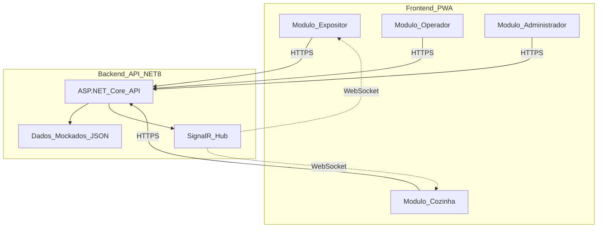

# FlowHub - Plano POC (Proof of Concept)

## Objetivo

Criar uma versão demonstrativa do FlowHub para validação do cliente, focada em **experiência visual e fluxos principais**, sem complexidade de integrações e infraestrutura completa.

---

## 1. Escopo da POC

### O que ENTRA (Funcionalidades Core)

**✅ 4 Interfaces PWA Funcionais:**

- Expositor: Dashboard, solicitar reposição de taças, ver equipamentos
- Operador: Scanner QR (simulado), registrar retirada/devolução
- Cozinha: Painel kanban em tempo real, atribuir garçons
- Administrador: Gerenciar eventos, clientes, equipamentos, gerar etiquetas

**✅ Dados Mockados:**

- 1 evento pré-configurado (FlowHub 2026)
- 10-15 clientes fictícios com kits comprados
- 50 equipamentos (champanheiras/cuspideiras) com QRCodes
- 20-30 solicitações de reposição em diferentes status
- 5 usuários (1 de cada perfil + garçons)

**✅ Funcionalidades Simplificadas:**

- Autenticação mockada (select de usuário, sem senha)
- SignalR para notificações em tempo real (entre as telas abertas)
- Scanner QR simulado (botão "Simular Scan" + dropdown de equipamentos)
- Geração de etiquetas PDF (QRCode + código de barras)
- Internacionalização PT/EN (troca de idioma funcional)

### ❌ O que FICA DE FORA (para versão completa)

- ❌ Integração com sistema externo (KS/WSP)
- ❌ KeyCloak / OAuth2 (login real com senha)
- ❌ Azure Functions / Service Bus
- ❌ Persistência em MongoDB (dados em memória ou JSON local)
- ❌ Redis / Cache distribuído
- ❌ CI/CD pipeline
- ❌ Testes automatizados
- ❌ Scanner QR real via câmera (apenas simulado)
- ❌ Email / notificações push externas
- ❌ Relatórios avançados / exportação

---

## 2. Arquitetura Simplificada da POC



### Stack Técnica POC

**Backend:**

- .NET 8.0 Web API (ASP.NET Core)
- SignalR (notificações tempo real)
- Dados em memória (Dictionary/List) ou JSON files
- QRCoder (geração de QRCodes)
- iTextSharp/QuestPDF (geração de PDFs)

**Frontend:**

- React ou Vue.js (SPA)
- Vite (build tool rápido)
- TailwindCSS ou Material UI (componentes prontos)
- @microsoft/signalr (cliente)
- react-qr-code ou vue-qrcode (exibir QRCodes)
- react-i18next / vue-i18n (PT/EN)

**Hospedagem POC:**

- Backend: Azure App Service (Free/Basic tier)
- Frontend: Azure Static Web Apps (Free tier) ou Vercel/Netlify
- **Total: ~$0-10/mês**

---

## 3. Estrutura de Dados Mockados

### 3.1 Arquivo: `MockData.json`

```json
{
  "events": [
    {
      "id": "evt-001",
      "name": "FlowHub 2026",
      "code": "PW2026",
      "startDate": "2026-03-15",
      "endDate": "2026-03-18",
      "location": "Expo Center Norte - São Paulo",
      "status": "Active"
    }
  ],
  "customers": [
    {
      "id": "cust-001",
      "cnpj": "12345678000190",
      "companyName": "Vinícola Aurora",
      "standNumber": "A123",
      "purchasedKitsQuantity": 3,
      "availableChampagneQuantity": 3,
      "pickedUpChampagneQuantity": 2,
      "availableSpittoonQuantity": 3,
      "pickedUpSpittoonQuantity": 1,
      "badgeQRCode": "BADGE-001"
    }
    // ... mais 9-14 clientes
  ],
  "equipments": [
    {
      "id": "equip-001",
      "equipmentNumber": "CHAMP-001",
      "type": "Champagne",
      "qrCode": "QR-CHAMP-001",
      "status": "Available"
    }
    // ... mais 49 equipamentos
  ],
  "serviceRequests": [
    {
      "id": "sr-001",
      "customerId": "cust-001",
      "standNumber": "A123",
      "requestedGlassQuantity": 25,
      "status": "Pending",
      "requestedAt": "2026-03-16T10:30:00Z"
    }
    // ... mais 19-29 solicitações
  ],
  "users": [
    {
      "id": "user-001",
      "name": "João Silva",
      "role": "Expositor",
      "customerId": "cust-001"
    },
    {
      "id": "user-002",
      "name": "Maria Santos",
      "role": "Operador"
    },
    {
      "id": "user-003",
      "name": "Carlos Pereira",
      "role": "Supervisor_Cozinha"
    },
    {
      "id": "user-004",
      "name": "Ana Costa",
      "role": "Garcom"
    },
    {
      "id": "user-005",
      "name": "Roberto Admin",
      "role": "Administrador"
    }
  ]
}
```

---

## 4. Funcionalidades por Módulo (POC)

### 4.1 Módulo Expositor

**Tela 1: Login Mockado**

- Dropdown com lista de expositores mockados
- Botão "Entrar como [Nome]"
- Seletor de idioma (PT/EN)

**Tela 2: Dashboard**

- Cards resumo: Kits comprados (3), Equipamentos retirados (3/6), Solicitações ativas (2)
- Botão destacado: "Solicitar Reposição de Taças"
- Lista de solicitações recentes (status, tempo de espera)
- Alertas: "1 equipamento próximo do prazo de devolução"

**Tela 3: Solicitar Reposição**

- Dropdown quantidade: 25, 50, 75, 100 taças
- Textarea opcional: observações
- Botão "Solicitar"
- Após envio: notificação "Solicitação enviada!" + atualiza dashboard

**Tela 4: Meus Equipamentos**

- Tabela: Tipo, Número, Data retirada, Status
- Badge visual: "No prazo" (verde), "Atenção" (amarelo), "Atrasado" (vermelho)

### 4.2 Módulo Operador

**Tela 1: Login Mockado**

- Dropdown com operadores mockados

**Tela 2: Scanner QR (Simulado)**

- Botão grande: "Simular Scan de Crachá"
- Modal abre com dropdown de clientes mockados
- Ao selecionar: mostra dados do cliente + saldo de equipamentos

**Tela 3: Registrar Retirada**

- Após scan do crachá, botão "Registrar Retirada de Equipamento"
- Dropdown: tipo (Champanheira/Cuspideira) + número do equipamento
- Botão "Confirmar Retirada"
- Feedback: "Equipamento CHAMP-001 retirado por Vinícola Aurora"

**Tela 4: Registrar Devolução**

- Botão "Simular Scan de Equipamento"
- Dropdown com equipamentos retirados
- Sistema verifica prazo automaticamente
- Se atrasado: modal "Multa de R$ 50,00 aplicada"
- Botão "Confirmar Devolução"

### 4.3 Módulo Cozinha

**Tela 1: Login Mockado**

- Dropdown: Supervisor ou Garçom

**Tela 2: Painel Kanban (Tempo Real)**

- 4 colunas: Pendente (8), Em Coleta (3), Em Lavagem (5), Concluído (10 hoje)
- Cards com: Stand, Quantidade, Tempo de espera, Garçom atribuído
- Cores: Vermelho (>15min), Amarelo (10-15min), Verde (<10min)
- **SignalR**: atualiza automaticamente quando novo pedido é criado

**Tela 3: Atribuir Solicitação (Supervisor)**

- Click no card pendente
- Modal: Dropdown com garçons disponíveis
- Botão "Atribuir para [Nome]"
- SignalR notifica o garçom

**Tela 4: Visão do Garçom**

- Lista apenas "Minhas Solicitações"
- Botões: "Coletado" → "Concluído"
- Timer de performance individual

### 4.4 Módulo Administrador

**Tela 1: Login Mockado**

- Dropdown com administrador

**Tela 2: Dashboard Admin**

- Tabs: Eventos, Clientes, Equipamentos, Etiquetas, Usuários

**Tela 3: Gerenciar Evento**

- Formulário: Nome, Código, Datas, Local
- Botão "Salvar" (salva em memória)

**Tela 4: Gerenciar Clientes**

- Tabela: CNPJ, Nome, Stand, Kits comprados
- Botões: Adicionar, Editar (modal), Excluir
- Filtro por nome/CNPJ

**Tela 5: Gerenciar Equipamentos**

- Botão "Gerar Lote de Equipamentos"
- Modal: Quantidade, Tipo (Champanheira/Cuspideira)
- Sistema gera IDs sequenciais + QRCodes

**Tela 6: Gerar Etiquetas**

- Dropdown: Selecionar equipamentos (multi-select)
- Botão "Gerar PDF"
- Download de PDF A4 com 6 etiquetas/página
- Cada etiqueta: QRCode + Código de barras + Número

---

## 5. Fluxo de Demonstração (Script)

**Cenário: Cliente é Expositor "Vinícola Aurora"**

### Ato 1: Expositor solicita reposição (2 min)

1. Abrir PWA Expositor → Login como "João Silva - Vinícola Aurora"
2. Dashboard mostra: 3 kits, 3 equipamentos retirados, 1 solicitação ativa
3. Click "Solicitar Reposição" → Selecionar 50 taças → Enviar
4. Notificação: "Solicitação enviada!"
5. Dashboard atualiza: agora 2 solicitações ativas

### Ato 2: Cozinha recebe em tempo real (1 min)

1. **[Outra aba/dispositivo]** Cozinha já está aberta
2. **SignalR**: Novo card aparece automaticamente na coluna "Pendente"
3. Card mostra: "Stand A123 - 50 taças - 0 min"
4. Supervisor click no card → Atribui para "Ana Costa (Garçom)"

### Ato 3: Garçom vê sua tarefa (1 min)

1. **[Outra aba]** Garçom Ana já está logada
2. **SignalR**: Notificação "Nova solicitação atribuída!"
3. Lista atualiza: "Stand A123 - 50 taças"
4. Ana click "Coletado" → status muda para "Em Coleta"
5. Após 30s, click "Concluído" → status "Concluído"

### Ato 4: Expositor é notificado (30s)

1. **[Volta para aba Expositor]**
2. **SignalR**: Notificação "Suas taças estão prontas!"
3. Dashboard atualiza: solicitação mudou para "Concluída"

### Ato 5: Operador registra devolução (1 min)

1. **[Outra aba]** Operador Maria logada
2. Click "Simular Scan Equipamento" → Seleciona "CHAMP-001"
3. Sistema mostra: Cliente "Vinícola Aurora", retirado há 2 dias
4. Botão "Confirmar Devolução" → Sucesso!

### Ato 6: Admin gera etiquetas (1 min)

1. **[Outra aba]** Admin Roberto logado
2. Tab "Equipamentos" → Botão "Gerar Lote"
3. Modal: 10 Champanheiras → "Gerar"
4. Sistema cria 10 equipamentos com QRCodes
5. Tab "Etiquetas" → Seleciona os 10 novos → "Gerar PDF"
6. Download PDF com etiquetas prontas para impressão

**Total: 6-7 minutos de demonstração fluida**

---

## 6. Estimativa de Tempo (2 Devs + Cursor)

### Semana 1-2: Setup + Backend (40h)

- **Dev 1 (Backend)**:
  - Setup projeto .NET 8 + estrutura de pastas (4h)
  - Criar controllers com dados mockados (8h)
  - Implementar SignalR Hub (4h)
  - Geração de QRCodes e etiquetas PDF (8h)
  - i18n backend (Resource files) (4h)
  - Deploy Azure App Service (4h)

- **Dev 2 (Frontend)**:
  - Setup React/Vue + TailwindCSS (4h)
  - Estrutura de rotas e layout base (8h)
  - Tela de login mockado + seletor idioma (4h)
  - Cliente SignalR + serviço API (4h)

### Semana 3: Frontend Módulos Expositor + Operador (40h)

- **Dev 1 (Expositor)**:
  - Dashboard (8h)
  - Solicitar reposição (4h)
  - Meus equipamentos (4h)
  - Integração SignalR (4h)

- **Dev 2 (Operador)**:
  - Scanner QR simulado (6h)
  - Retirada de equipamento (6h)
  - Devolução de equipamento (6h)
  - Validação de multas (2h)

### Semana 4: Frontend Módulos Cozinha + Admin (40h)

- **Dev 1 (Cozinha)**:
  - Painel kanban (10h)
  - Atribuir solicitações (4h)
  - Visão garçom (4h)
  - SignalR notificações (2h)

- **Dev 2 (Admin)**:
  - CRUD Eventos (4h)
  - CRUD Clientes (6h)
  - CRUD Equipamentos (4h)
  - Gerar etiquetas (4h)
  - Gestão usuários (2h)

### Semana 5: Ajustes Finais + Deploy (20h)

- Testes manuais em todos os fluxos (8h)
- Ajustes de UX/UI (6h)
- Preparar dados mockados realistas (2h)
- Deploy e testes em ambiente (4h)

**Total: 5 semanas (160h) = ~$8k-12k (2 devs)**

---

## 7. Estrutura de Projeto POC

```
FlowHub.POC/
├── backend/
│   ├── FlowHub.POC.API/
│   │   ├── Controllers/
│   │   │   ├── CustomersController.cs
│   │   │   ├── EquipmentsController.cs
│   │   │   ├── ServiceRequestsController.cs
│   │   │   └── LabelsController.cs
│   │   ├── Hubs/
│   │   │   └── FlowHubHub.cs
│   │   ├── Models/
│   │   │   └── (DTOs mockados)
│   │   ├── Services/
│   │   │   ├── MockDataService.cs
│   │   │   ├── QRCodeService.cs
│   │   │   └── LabelService.cs
│   │   └── Data/
│   │       └── mock-data.json
│   └── FlowHub.POC.API.csproj
│
├── frontend/
│   ├── src/
│   │   ├── modules/
│   │   │   ├── expositor/
│   │   │   ├── operador/
│   │   │   ├── cozinha/
│   │   │   └── administrador/
│   │   ├── components/
│   │   ├── services/
│   │   │   ├── api.service.js
│   │   │   └── signalr.service.js
│   │   ├── i18n/
│   │   │   ├── pt-BR.json
│   │   │   └── en-US.json
│   │   └── App.jsx
│   ├── package.json
│   └── vite.config.js
│
└── README.md (instruções para rodar POC)
```

---

## 8. Benefícios da POC

### Para o Cliente:

- ✅ **Visualiza a solução completa** funcionando em 5 semanas
- ✅ **Valida fluxos e UX** antes do investimento completo
- ✅ **Decide sobre mudanças** antes do desenvolvimento final
- ✅ **Demonstra para stakeholders** sem riscos

### Para o Projeto:

- ✅ **Reduz riscos técnicos** (valida SignalR, geração de PDFs, etc.)
- ✅ **Treina a equipe** na stack antes do projeto real
- ✅ **Código reutilizável**: ~60% do frontend e 40% do backend podem ser aproveitados
- ✅ **Feedback rápido**: iterações semanais com o cliente

### Investimento:

- **POC**: 5 semanas (~$10k)
- **Versão Completa**: +8 semanas (~$20k)
- **Total**: 13 semanas (~$30k) vs 13 semanas ($35k) direto

**ROI**: A POC "paga por si mesma" evitando retrabalho e validando decisões críticas antecipadamente.

---

## 9. Transição POC → Produção

Após aprovação da POC, a evolução para produção envolve:

1. **Substituir dados mockados** por MongoDB
2. **Implementar autenticação real** com KeyCloak
3. **Adicionar integração** KS/WSP (webhook/polling)
4. **Migrar para Azure Functions** (processos assíncronos)
5. **Adicionar testes automatizados** (unitários + integração)
6. **Implementar scanner QR real** via câmera
7. **Adicionar Redis** para cache distribuído
8. **Configurar CI/CD** pipeline

**Tempo estimado: +8 semanas**

---

## 10. Próximos Passos

### Decisão do Cliente:

- [ ] Aprovar escopo da POC
- [ ] Definir stack frontend (React vs Vue.js)
- [ ] Validar dados mockados (quantidade, cenários)
- [ ] Confirmar orçamento e prazo

### Início do Desenvolvimento:

- [ ] Setup repositório Git
- [ ] Criar projetos backend + frontend
- [ ] Definir sprint plan (sprints de 1 semana)
- [ ] Reuniões semanais de demo

**Data sugerida para primeira demo: Final da Semana 2 (Backend + Login)**