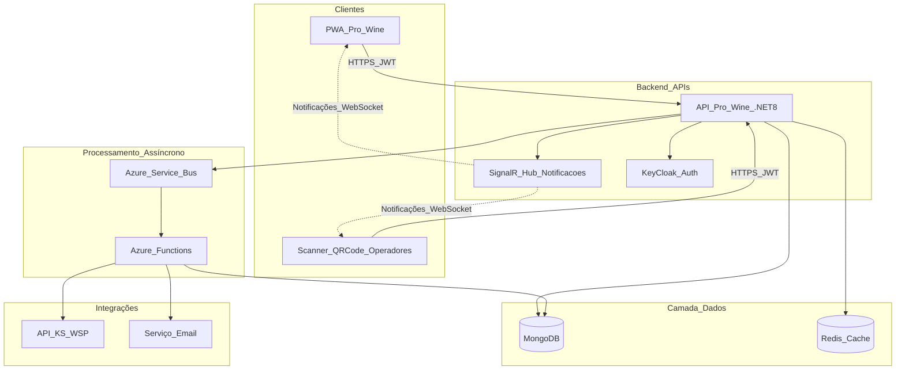
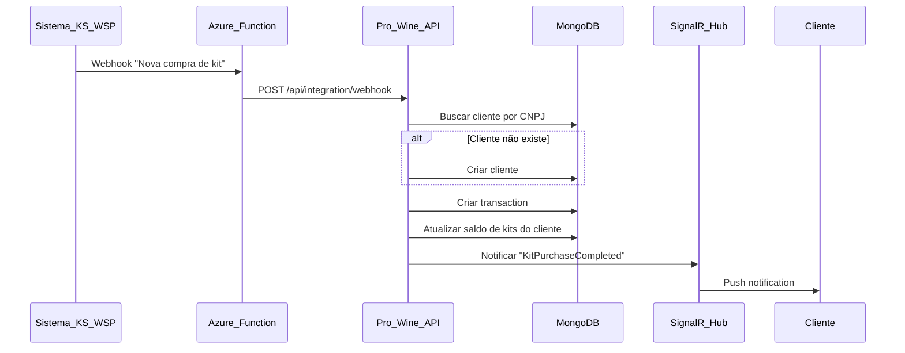
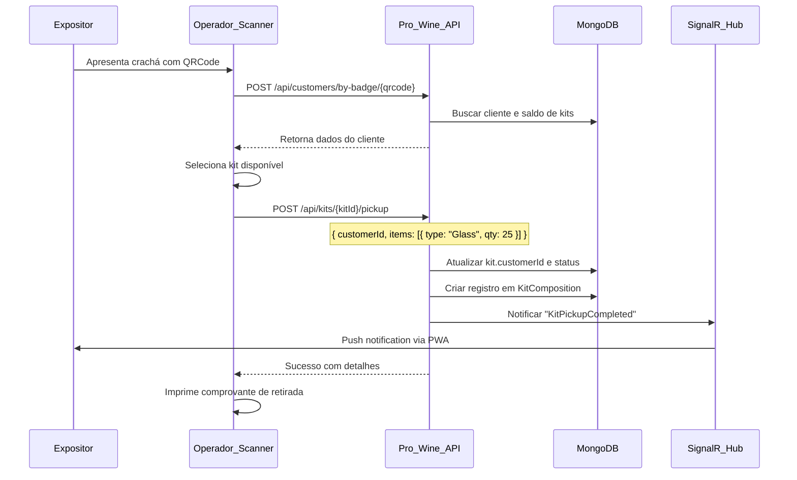
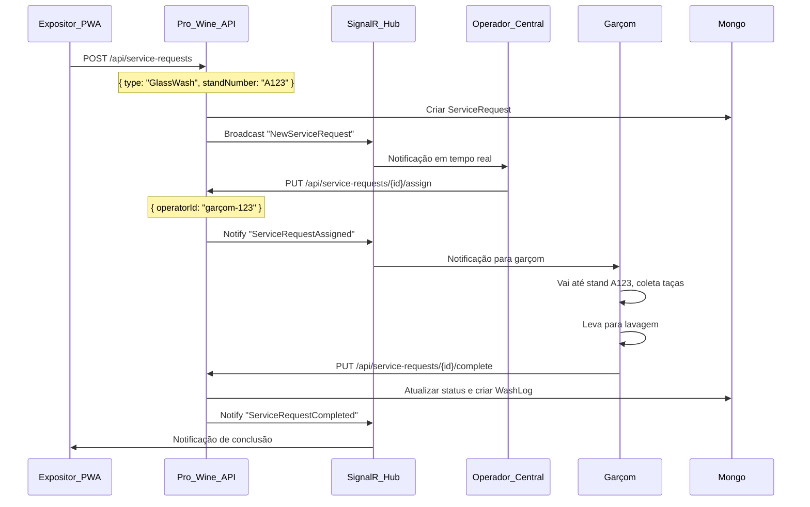
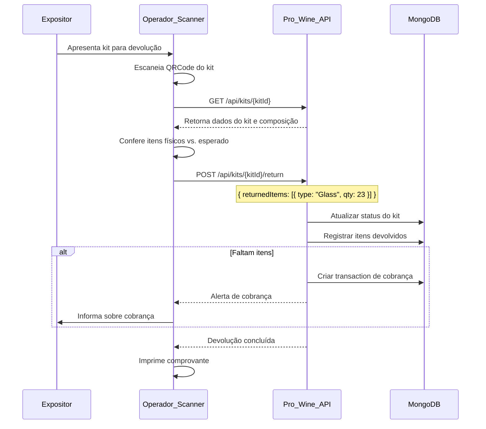

# FlowHub - Desenho de Solução

## 1. Visão Geral da Arquitetura

A solução será desenvolvida seguindo a mesma arquitetura em camadas do projeto existente (Automação Cotações), aproveitando a infraestrutura já consolidada:

- **Backend**: .NET 8.0 Web API + SignalR (notificações em tempo real)
- **Frontend**: PWA (Progressive Web App) com React/Vue.js
- **Banco de Dados**: MongoDB (principal) + Redis (cache)
- **Autenticação**: KeyCloak (OAuth2/OIDC)
- **Mensageria**: Azure Service Bus (processos assíncronos)
- **Hospedagem**: Azure App Services + Azure Functions
- **Observabilidade**: Application Insights + Serilog

### Diagrama de Arquitetura



## 2. Estrutura do Projeto (.NET)

Seguindo o padrão existente, criar nova solution `Mafra.FlowHub`:

```
Mafra.FlowHub/
├── 0.Utilities/
│   └── Mafra.FlowHub.Utilities/          # Enums, extensions, helpers
├── 1.Presentation/
│   ├── Mafra.FlowHub.API/                # Web API principal
│   └── Mafra.FlowHub.SignalR/            # Hub de notificações
├── 2.Domain/
│   └── Mafra.FlowHub.Domain/             # Entidades, interfaces, DTOs
├── 3.Infra/
│   ├── Mafra.FlowHub.Infra.Mongo/        # Repositórios MongoDB
│   ├── Mafra.FlowHub.Infra.RedisCache/   # Cache distribuído
│   └── Mafra.FlowHub.Infra.Integration/  # Integração KS/WSP
├── 4.Service/
│   └── Mafra.FlowHub.Service/            # Lógica de negócio
├── 5.Tests/
│   ├── Mafra.FlowHub.UnitTests/
│   └── Mafra.FlowHub.IntegrationTests/
├── 6.Localization/
│   └── Mafra.FlowHub.Localization/       # pt-BR, en-US
└── 7.Functions/
    └── Mafra.FlowHub.Functions/          # Azure Functions (sync KS/WSP)
```

## 3. Modelo de Domínio (Entidades Principais)

### 3.1 Event (Evento/Feira)

```csharp
public class Event : Entity<Guid>
{
    public string Name { get; set; }              // "FlowHub 2026"
    public string Code { get; set; }              // "PW2026"
    public DateTime StartDate { get; set; }
    public DateTime EndDate { get; set; }
    public string Location { get; set; }
    public EventStatus Status { get; set; }       // Draft, Active, Finished
    public Dictionary<string, string> Translations { get; set; } // i18n
}
```

### 3.2 Customer (Cliente/Expositor)

```csharp
public class Customer : Entity<Guid>
{
    public string CNPJ { get; set; }
    public string CompanyName { get; set; }
    public string ContactName { get; set; }
    public string Email { get; set; }
    public string Phone { get; set; }
    public Guid EventId { get; set; }
    public string BadgeQRCode { get; set; }       // QRCode único do crachá
    public string BadgeBarcode { get; set; }      // Código de barras do crachá
    public DateTime CreatedAt { get; set; }
    public string ExternalCustomerId { get; set; } // ID do cliente no KS/WSP
}
```

### 3.3 Kit (Pack de Taças)

```csharp
public class Kit : Entity<Guid>
{
    public string KitNumber { get; set; }         // Número sequencial
    public string QRCode { get; set; }            // QRCode único do kit
    public string Barcode { get; set; }           // Código de barras
    public Guid EventId { get; set; }
    public Guid? CustomerId { get; set; }         // Null se não retirado
    public KitStatus Status { get; set; }         // Available, PickedUp, Returned
    public DateTime? PickupDate { get; set; }
    public DateTime? ReturnDate { get; set; }
    public string ExternalOrderId { get; set; }   // ID da compra no KS/WSP
}
```

### 3.4 KitComposition (Composição do Kit)

```csharp
public class KitComposition : Entity<Guid>
{
    public Guid KitId { get; set; }
    public KitItemType ItemType { get; set; }     // Glass, Champagne, Spittoon
    public int Quantity { get; set; }
    public int PickedUpQuantity { get; set; }     // Retirados parcialmente
    public int ReturnedQuantity { get; set; }     // Devolvidos
}
```

### 3.5 ServiceRequest (Solicitação de Serviço)

```csharp
public class ServiceRequest : Entity<Guid>
{
    public Guid CustomerId { get; set; }
    public Guid EventId { get; set; }
    public ServiceRequestType Type { get; set; }  // GlassWash, ChampagneRefill, SpittoonRefill
    public ServiceRequestStatus Status { get; set; } // Pending, InProgress, Completed, Cancelled
    public string StandNumber { get; set; }
    public string Notes { get; set; }
    public DateTime RequestedAt { get; set; }
    public Guid? AssignedOperatorId { get; set; }
    public DateTime? CompletedAt { get; set; }
    public int? Rating { get; set; }              // Avaliação do serviço (1-5)
}
```

### 3.6 Equipment (Champanheira/Cuspideira)

```csharp
public class Equipment : Entity<Guid>
{
    public string QRCode { get; set; }
    public string Barcode { get; set; }
    public EquipmentType Type { get; set; }       // Champagne, Spittoon
    public EquipmentStatus Status { get; set; }   // Available, InUse, Maintenance
    public Guid EventId { get; set; }
    public Guid? CurrentCustomerId { get; set; }
    public DateTime? PickupDate { get; set; }
    public DateTime? ExpectedReturnDate { get; set; }
    public decimal? NonReturnFee { get; set; }    // Valor da multa
}
```

### 3.7 WashLog (Histórico de Lavagem)

```csharp
public class WashLog : Entity<Guid>
{
    public Guid KitId { get; set; }
    public Guid CustomerId { get; set; }
    public Guid ServiceRequestId { get; set; }
    public int GlassQuantity { get; set; }
    public DateTime WashedAt { get; set; }
    public Guid OperatorId { get; set; }
}
```

### 3.8 Transaction (Transação Financeira)

```csharp
public class Transaction : Entity<Guid>
{
    public Guid CustomerId { get; set; }
    public Guid EventId { get; set; }
    public TransactionType Type { get; set; }     // KitPurchase, EquipmentNonReturn, AdditionalService
    public decimal Amount { get; set; }
    public string Description { get; set; }
    public DateTime CreatedAt { get; set; }
    public string ExternalTransactionId { get; set; } // ID no sistema de pagamento
}
```

## 4. APIs e Endpoints

### 4.1 Event Management API

- `GET /api/events` - Lista eventos (OData)
- `POST /api/events` - Criar evento
- `PUT /api/events/{id}` - Atualizar evento
- `GET /api/events/{id}/dashboard` - Dashboard do evento

### 4.2 Customer API

- `GET /api/events/{eventId}/customers` - Lista clientes (OData)
- `POST /api/events/{eventId}/customers` - Criar cliente
- `GET /api/customers/{id}` - Detalhes do cliente
- `GET /api/customers/by-badge/{qrcode}` - Buscar por QRCode do crachá

### 4.3 Kit Management API

- `GET /api/events/{eventId}/kits` - Lista kits (OData)
- `POST /api/events/{eventId}/kits/generate` - Gerar lote de kits
- `POST /api/kits/{kitId}/pickup` - Registrar retirada (bipagem QRCode)
- `POST /api/kits/{kitId}/return` - Registrar devolução (bipagem QRCode)
- `GET /api/kits/{kitId}/history` - Histórico do kit
- `POST /api/kits/{kitId}/partial-pickup` - Retirada parcial de itens

### 4.4 Service Request API

- `POST /api/service-requests` - Criar solicitação (pelo expositor via PWA)
- `GET /api/service-requests/pending` - Lista pendentes (central)
- `PUT /api/service-requests/{id}/assign` - Atribuir operador
- `PUT /api/service-requests/{id}/complete` - Concluir serviço
- `GET /api/customers/{customerId}/service-requests` - Histórico do cliente

### 4.5 Equipment API

- `GET /api/events/{eventId}/equipment` - Lista equipamentos (OData)
- `POST /api/equipment/{id}/pickup` - Registrar retirada
- `POST /api/equipment/{id}/return` - Registrar devolução
- `GET /api/equipment/{id}/status` - Status do equipamento

### 4.6 Integration API (KS/WSP)

- `POST /api/integration/sync-orders` - Sincronizar pedidos (Azure Function)
- `POST /api/integration/webhook` - Webhook de notificação de compra
- `GET /api/integration/customer-orders/{cnpj}` - Buscar pedidos do cliente

### 4.7 Reports API

- `GET /api/reports/wash-log` - Relatório de lavagens
- `GET /api/reports/service-requests` - Relatório de solicitações
- `GET /api/reports/equipment-usage` - Relatório de equipamentos
- `GET /api/reports/financial` - Relatório financeiro

## 5. SignalR Hub - Notificações em Tempo Real

### FlowHubHub

```csharp
public class FlowHubHub : Hub
{
    // Grupos por tipo de usuário
    public async Task JoinOperatorGroup() 
        => await Groups.AddToGroupAsync(Context.ConnectionId, "Operators");
    
    public async Task JoinCustomerGroup(Guid customerId) 
        => await Groups.AddToGroupAsync(Context.ConnectionId, $"Customer-{customerId}");
    
    // Notificações enviadas pelo servidor
    // - NewServiceRequest (para operadores)
    // - ServiceRequestUpdated (para cliente e operadores)
    // - KitPickupCompleted (para cliente)
    // - EquipmentReturnReminder (para cliente)
}
```

### Tipos de Notificações

1. **NewServiceRequest**: Nova solicitação criada (→ Operadores)
2. **ServiceRequestAssigned**: Solicitação atribuída (→ Operador específico)
3. **ServiceRequestCompleted**: Serviço concluído (→ Cliente)
4. **KitPickupCompleted**: Kit retirado com sucesso (→ Cliente)
5. **KitReturnReminder**: Lembrete de devolução (→ Cliente)
6. **EquipmentOverdue**: Equipamento atrasado (→ Administradores)

## 6. Integração com Sistema de Vendas (KS/WSP)

### 6.1 Fluxo de Sincronização



### 6.2 Azure Function - Sincronização Periódica

- **Trigger**: Timer (a cada 5 minutos)
- **Função**: Buscar pedidos novos no KS/WSP desde última sincronização
- **Ações**:

  1. Chamar API KS/WSP (GET /orders?since={lastSync})
  2. Para cada pedido novo:

     - Criar/atualizar cliente
     - Registrar transaction
     - Atualizar saldo de kits disponíveis

  1. Atualizar timestamp da última sincronização

### 6.3 Webhook (Notificação Instantânea)

- KS/WSP envia POST quando nova compra é realizada
- Endpoint: `POST /api/integration/webhook`
- Autenticação: API Key ou HMAC signature
- Payload esperado:
```json
{
  "orderId": "KS-12345",
  "cnpj": "12345678000190",
  "customerName": "Vinícola XYZ",
  "items": [
    {
      "productCode": "KIT-TACAS-01",
      "quantity": 2
    }
  ],
  "totalAmount": 500.00,
  "orderDate": "2026-01-26T10:30:00Z"
}
```


## 7. PWA (Progressive Web App)

### 7.1 Módulos do PWA

#### Módulo Expositor

- **Dashboard**: Resumo dos kits, solicitações ativas, histórico
- **Solicitações**: Criar nova solicitação (lavagem, champanheira, cuspideira)
- **Meus Kits**: Visualizar kits retirados, itens disponíveis
- **Histórico de Lavagens**: Quantas vezes solicitou lavagem
- **Equipamentos**: Status de champanheiras/cuspideiras retiradas
- **Perfil**: Dados do cliente, evento atual

#### Módulo Operador (Central)

- **Dashboard**: Solicitações pendentes, em andamento, concluídas
- **Scanner QRCode**: Câmera para bipar kits, equipamentos, crachás
- **Fila de Solicitações**: Lista priorizada de serviços
- **Retirada de Kits**: Fluxo de retirada com validação
- **Devolução de Kits**: Fluxo de devolução com checklist
- **Histórico de Operações**: Log de ações realizadas

#### Módulo Administrador

- **Gerenciar Eventos**: CRUD de eventos
- **Gerenciar Clientes**: CRUD de clientes
- **Gerenciar Kits**: Gerar kits, visualizar status
- **Gerenciar Equipamentos**: CRUD de equipamentos
- **Relatórios**: Dashboards analíticos
- **Configurações**: Parâmetros do sistema

#### Módulo Garçom

- **Check-in**: Registrar presença no evento
- **Tarefas**: Lista de serviços atribuídos
- **Scanner QRCode**: Escanear kit para confirmar lavagem
- **Finalizar Serviço**: Marcar como concluído

#### Módulo Gerente

- **Dashboard Executivo**: KPIs, métricas de performance
- **Relatórios Financeiros**: Receitas, multas, cobranças
- **Análise de Serviços**: Tempo médio, satisfação
- **Gestão de Usuários**: Operadores, garçons, permissões

### 7.2 Tecnologias PWA Recomendadas

- **Framework**: React 18+ ou Vue 3+ com Vite
- **UI Library**: Material-UI (MUI) ou Ant Design
- **State Management**: Zustand ou Redux Toolkit
- **Real-time**: @microsoft/signalr client
- **QR Code**: html5-qrcode ou react-qr-scanner
- **Offline Support**: Workbox (service workers)
- **i18n**: react-i18next ou vue-i18n
- **Build**: Vite PWA Plugin

### 7.3 Features PWA Essenciais

1. **Service Worker**: Cache de assets, offline fallback
2. **Manifest**: Instalável no dispositivo
3. **Push Notifications**: Notificações nativas do navegador
4. **Offline Mode**: Funcionalidades básicas sem internet
5. **Responsive Design**: Mobile-first, adaptável a tablets

## 8. Fluxos Principais

### 8.1 Fluxo de Retirada de Kit



### 8.2 Fluxo de Solicitação de Lavagem



### 8.3 Fluxo de Devolução de Kit



## 9. Segurança e Permissões

### 9.1 Perfis de Usuário

1. **Expositor**: Acesso apenas aos seus kits e solicitações
2. **Operador**: Gerenciar solicitações, bipar QRCodes
3. **Garçom**: Executar serviços atribuídos
4. **Gerente**: Visualizar relatórios e métricas
5. **Administrador**: Acesso completo ao sistema

### 9.2 Políticas de Autorização

```csharp
public static class FlowHubPermissions
{
    public const string ViewOwnKits = "FlowHub:ViewOwnKits";
    public const string CreateServiceRequest = "FlowHub:CreateServiceRequest";
    public const string ManageServiceRequests = "FlowHub:ManageServiceRequests";
    public const string ScanQRCode = "FlowHub:ScanQRCode";
    public const string ManageKits = "FlowHub:ManageKits";
    public const string ManageEquipment = "FlowHub:ManageEquipment";
    public const string ViewReports = "FlowHub:ViewReports";
    public const string ManageEvents = "FlowHub:ManageEvents";
    public const string ManageCustomers = "FlowHub:ManageCustomers";
}
```

### 9.3 Proteções

- JWT tokens com expiração (1h access token, 7d refresh token)
- Rate limiting (10 req/s por usuário)
- CORS configurado apenas para domínios autorizados
- HTTPS obrigatório
- Validação de QRCode único por requisição
- Logs de auditoria para operações críticas

## 10. QRCode e Etiquetas

### 10.1 Estrutura do QRCode

- **Formato**: JSON compactado em Base64
- **Conteúdo**:
```json
{
  "type": "KIT|BADGE|EQUIPMENT",
  "id": "guid-aqui",
  "event": "PW2026",
  "checksum": "hash-validacao"
}
```


### 10.2 Geração de Etiquetas

- **Biblioteca**: QRCoder (.NET) ou ZXing
- **Tamanho**: Mínimo 3x3 cm para leitura confiável
- **Material**: Etiqueta resistente à água/lavagem (poliéster, vinil)
- **Impressão**: Térmica ou laser (não jato de tinta)
- **Redundância**: QRCode + Código de Barras (Code 128)

### 10.3 Leitura via PWA

- **Permissões**: Solicitar acesso à câmera
- **Biblioteca**: html5-qrcode
- **Validação**: Verificar checksum antes de chamar API
- **Feedback**: Vibração + som + animação de sucesso/erro

## 11. Internacionalização (i18n)

### 11.1 Idiomas Suportados

- Português (pt-BR) - padrão
- Inglês (en-US)

### 11.2 Implementação Backend

- Resource files (.resx) no projeto `Mafra.FlowHub.Localization`
- Middleware de localização configurado via `Accept-Language` header
- DTOs com propriedade `Dictionary<string, string> Translations`

### 11.3 Implementação Frontend

- react-i18next ou vue-i18n
- Detector de idioma do navegador
- Switch manual de idioma no header do PWA
- Persistir preferência no localStorage

## 12. Infraestrutura e DevOps

### 12.1 Ambientes

- **Development**: Localhost + MongoDB Atlas (free tier)
- **Staging**: Azure App Service (B1) + MongoDB Atlas (shared cluster)
- **Production**: Azure App Service (P1V2) + MongoDB Atlas (M10)

### 12.2 CI/CD (Azure DevOps)

- **Build Pipeline**:

  1. Restore NuGet packages
  2. Build solution
  3. Run unit tests
  4. Run integration tests
  5. Code coverage (≥80%)
  6. Build Docker image
  7. Push to Azure Container Registry

- **Release Pipeline**:

  1. Deploy API to App Service
  2. Deploy Azure Functions
  3. Deploy PWA to Azure Static Web Apps
  4. Run smoke tests
  5. Notify team (Teams/Slack)

### 12.3 Monitoramento

- **Application Insights**: Métricas, traces, exceptions
- **Serilog**: Logs estruturados (Seq ou Elasticsearch)
- **Health Checks**: Endpoint `/health` com status de dependências
- **Alertas**: Tempo de resposta >2s, erro rate >5%

## 13. Estimativa de Recursos

### 13.1 Azure Resources (Produção)

- App Service (P1V2): ~$75/mês
- MongoDB Atlas (M10): ~$60/mês
- Redis Cache (C1): ~$45/mês
- Azure Functions (Consumption): ~$10/mês
- Application Insights: ~$20/mês
- Azure Service Bus (Basic): ~$10/mês
- Static Web Apps (Standard): ~$9/mês
- **Total Estimado**: ~$230/mês

### 13.2 Licenças

- KeyCloak: Open source (auto-hospedado ou Keycloak Cloud)
- .NET 8: Gratuito
- MongoDB Community: Gratuito

## 14. Próximos Passos

1. **Aprovação do Desenho**: Validar com stakeholders
2. **Protótipo de UI**: Criar mockups do PWA (Figma)
3. **Proof of Concept**: Implementar fluxo de retirada + QRCode
4. **Definir Contrato da API KS/WSP**: Documentação da integração
5. **Setup do Ambiente**: Provisionar recursos Azure + MongoDB
6. **Desenvolvimento Iterativo**: Sprints de 2 semanas