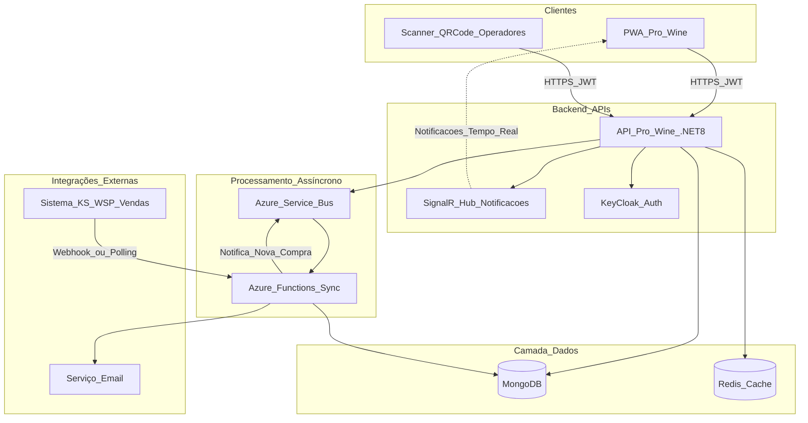
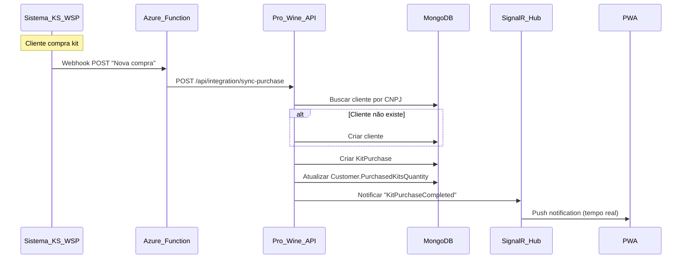
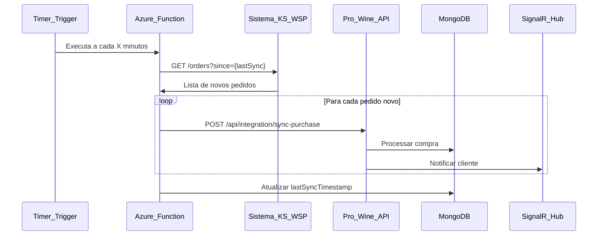
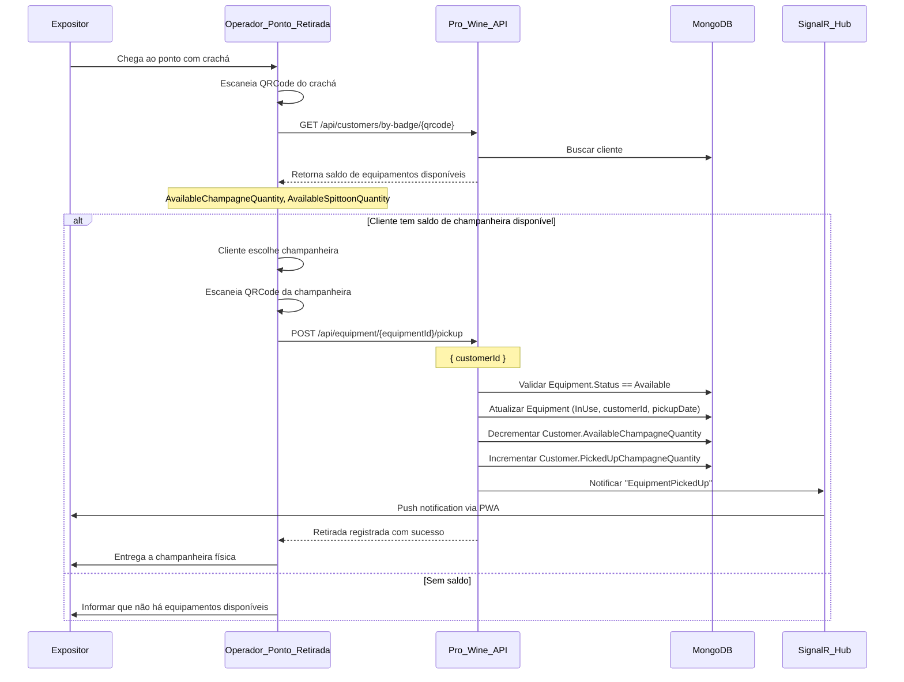
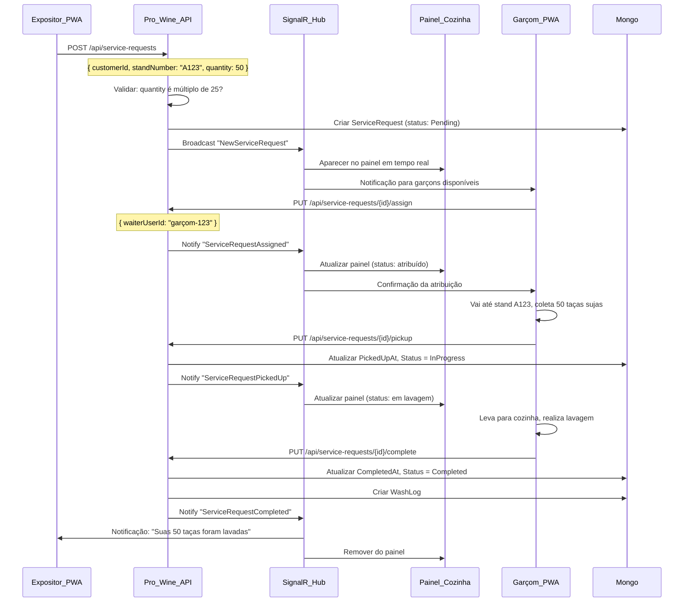
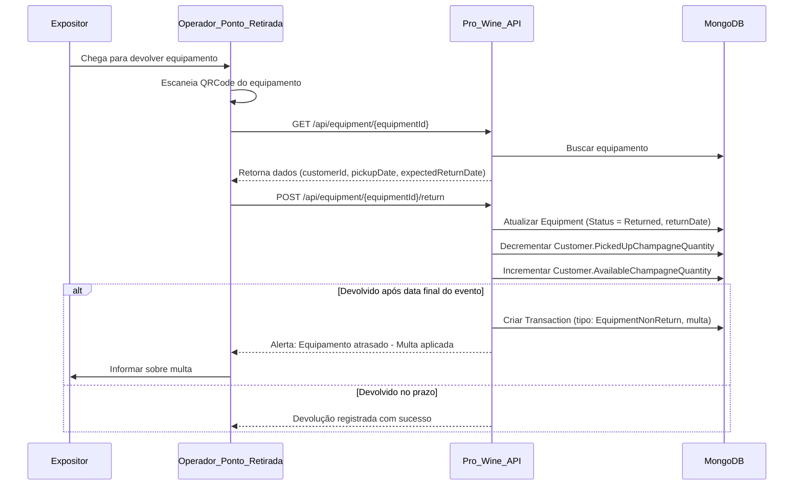
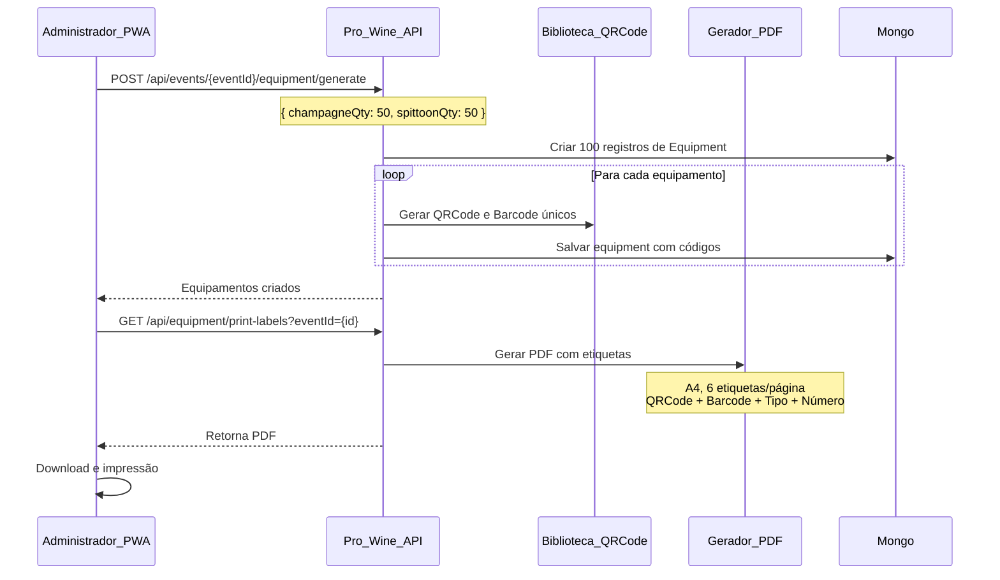

# FlowHub - Desenho de Solução

## 1. Visão Geral da Arquitetura

A solução será desenvolvida seguindo a mesma arquitetura em camadas do projeto existente (Automação Cotações), aproveitando a infraestrutura já consolidada:

- **Backend**: .NET 8.0 Web API + SignalR (notificações em tempo real)
- **Frontend**: PWA (Progressive Web App) com React/Vue.js
- **Banco de Dados**: MongoDB (principal) + Redis (cache)
- **Autenticação**: KeyCloak (OAuth2/OIDC)
- **Mensageria**: Azure Service Bus (processos assíncronos)
- **Hospedagem**: Azure App Services + Azure Functions
- **Observabilidade**: Application Insights + Serilog

### Diagrama de Arquitetura



## 2. Estrutura do Projeto (.NET)

Seguindo o padrão existente, criar nova solution `Mafra.FlowHub`:

```
Mafra.FlowHub/
├── 0.Utilities/
│   └── Mafra.FlowHub.Utilities/          # Enums, extensions, helpers
├── 1.Presentation/
│   ├── Mafra.FlowHub.API/                # Web API principal
│   └── Mafra.FlowHub.SignalR/            # Hub de notificações
├── 2.Domain/
│   └── Mafra.FlowHub.Domain/             # Entidades, interfaces, DTOs
├── 3.Infra/
│   ├── Mafra.FlowHub.Infra.Mongo/        # Repositórios MongoDB
│   ├── Mafra.FlowHub.Infra.RedisCache/   # Cache distribuído
│   └── Mafra.FlowHub.Infra.Integration/  # Integração KS/WSP
├── 4.Service/
│   └── Mafra.FlowHub.Service/            # Lógica de negócio
├── 5.Tests/
│   ├── Mafra.FlowHub.UnitTests/
│   └── Mafra.FlowHub.IntegrationTests/
├── 6.Localization/
│   └── Mafra.FlowHub.Localization/       # pt-BR, en-US
└── 7.Functions/
    └── Mafra.FlowHub.Functions/          # Azure Functions (sync KS/WSP)
```

## 3. Modelo de Domínio (Entidades Principais)

### 3.1 Event (Evento/Feira)

```csharp
public class Event : Entity<Guid>
{
    public string Name { get; set; }              // "FlowHub 2026"
    public string Code { get; set; }              // "PW2026"
    public DateTime StartDate { get; set; }
    public DateTime EndDate { get; set; }
    public string Location { get; set; }
    public EventStatus Status { get; set; }       // Draft, Active, Finished
    public Dictionary<string, string> Translations { get; set; } // i18n
}
```

### 3.2 Customer (Cliente/Expositor)

```csharp
public class Customer : Entity<Guid>
{
    public string CNPJ { get; set; }
    public string CompanyName { get; set; }
    public string ContactName { get; set; }
    public string Email { get; set; }
    public string Phone { get; set; }
    public Guid EventId { get; set; }
    public string BadgeQRCode { get; set; }       // QRCode único do crachá
    public string BadgeBarcode { get; set; }      // Código de barras do crachá
    public string StandNumber { get; set; }       // Número do stand do expositor
    
    // Controle de Kits Comprados (1 kit = 25 taças + 1 champanheira + 1 cuspideira)
    public int PurchasedKitsQuantity { get; set; } // Total de kits comprados (da integração KS/WSP)
    
    // Controle de Equipamentos (Champanheira e Cuspideira) - LIMITE baseado nos kits
    public int AvailableChampagneQuantity { get; set; }  // Champanheiras disponíveis para retirada
    public int PickedUpChampagneQuantity { get; set; }   // Champanheiras retiradas (não devolvidas)
    public int AvailableSpittoonQuantity { get; set; }   // Cuspideiras disponíveis para retirada
    public int PickedUpSpittoonQuantity { get; set; }    // Cuspideiras retiradas (não devolvidas)
    
    public DateTime CreatedAt { get; set; }
    public string ExternalCustomerId { get; set; } // ID do cliente no KS/WSP
}
```

### 3.3 KitPurchase (Registro de Compra de Kit)

```csharp
public class KitPurchase : Entity<Guid>
{
    public Guid CustomerId { get; set; }
    public Guid EventId { get; set; }
    public int Quantity { get; set; }             // Quantidade de kits comprados nesta compra
    public string ExternalOrderId { get; set; }   // ID da compra no KS/WSP
    public DateTime PurchasedAt { get; set; }
    public decimal Amount { get; set; }
    public string Notes { get; set; }
}
```

### 3.4 ServiceRequest (Solicitação de Reposição de Taças)

```csharp
public class ServiceRequest : Entity<Guid>
{
    public Guid CustomerId { get; set; }
    public Guid EventId { get; set; }
    public ServiceRequestStatus Status { get; set; } // Pending, InProgress, Completed, Cancelled
    public string StandNumber { get; set; }
    public int RequestedGlassQuantity { get; set; } // Múltiplos de 25 (25, 50, 75...) - SEM LIMITE
    public string Notes { get; set; }
    public DateTime RequestedAt { get; set; }
    public Guid? AssignedWaiterUserId { get; set; } // Garçom atribuído
    public DateTime? PickedUpAt { get; set; }     // Quando o garçom coletou as taças no stand
    public DateTime? CompletedAt { get; set; }    // Quando a lavagem foi concluída
    public int? Rating { get; set; }              // Avaliação do serviço (1-5)
}
```

### 3.5 Equipment (Champanheira/Cuspideira)

```csharp
public class Equipment : Entity<Guid>
{
    public string EquipmentNumber { get; set; }   // Número sequencial (ex: "CHAMP-001", "CUSP-042")
    public string QRCode { get; set; }
    public string Barcode { get; set; }
    public EquipmentType Type { get; set; }       // Champagne, Spittoon
    public EquipmentStatus Status { get; set; }   // Available, InUse, Returned, Maintenance
    public Guid EventId { get; set; }
    public Guid? CurrentCustomerId { get; set; }
    public DateTime? PickupDate { get; set; }
    public DateTime? ReturnDate { get; set; }
    public DateTime? ExpectedReturnDate { get; set; } // Data final do evento
    public decimal NonReturnFee { get; set; }     // Valor da multa configurável
    public string PickupLocationCode { get; set; } // Local de retirada (ex: "PONTO-A", "PONTO-B")
    public Guid? PickedUpByOperatorId { get; set; } // Operador que registrou retirada
    public Guid? ReturnedToOperatorId { get; set; } // Operador que registrou devolução
}
```

### 3.6 WashLog (Histórico de Lavagem)

```csharp
public class WashLog : Entity<Guid>
{
    public Guid CustomerId { get; set; }
    public Guid ServiceRequestId { get; set; }
    public int GlassQuantity { get; set; }        // Quantidade lavada nesta operação
    public DateTime PickedUpAt { get; set; }      // Quando foi coletado no stand
    public DateTime WashedAt { get; set; }        // Quando foi lavado
    public DateTime? DeliveredAt { get; set; }    // Quando foi devolvido limpo ao stand
    public Guid WaiterUserId { get; set; }        // Garçom responsável
}
```

### 3.7 Transaction (Transação Financeira)

```csharp
public class Transaction : Entity<Guid>
{
    public Guid CustomerId { get; set; }
    public Guid EventId { get; set; }
    public TransactionType Type { get; set; }     // KitPurchase, EquipmentNonReturn, AdditionalService
    public decimal Amount { get; set; }
    public string Description { get; set; }
    public DateTime CreatedAt { get; set; }
    public string ExternalTransactionId { get; set; } // ID no sistema de pagamento
}
```

## 4. APIs e Endpoints

### 4.1 Event Management API

- `GET /api/events` - Lista eventos (OData)
- `POST /api/events` - Criar evento
- `PUT /api/events/{id}` - Atualizar evento
- `GET /api/events/{id}/dashboard` - Dashboard do evento

### 4.2 Customer API

- `GET /api/events/{eventId}/customers` - Lista clientes (OData)
- `POST /api/events/{eventId}/customers` - Criar cliente
- `GET /api/customers/{id}` - Detalhes do cliente
- `GET /api/customers/by-badge/{qrcode}` - Buscar por QRCode do crachá

### 4.3 Kit Purchase API

- `GET /api/events/{eventId}/kit-purchases` - Lista compras de kits (OData)
- `GET /api/customers/{customerId}/kit-purchases` - Histórico de compras do cliente

### 4.4 Service Request API

- `POST /api/service-requests` - Criar solicitação (pelo expositor via PWA)
- `GET /api/service-requests/pending` - Lista pendentes (central)
- `PUT /api/service-requests/{id}/assign` - Atribuir operador
- `PUT /api/service-requests/{id}/complete` - Concluir serviço
- `GET /api/customers/{customerId}/service-requests` - Histórico do cliente

### 4.5 Equipment API (Champanheira/Cuspideira)

- `GET /api/events/{eventId}/equipment` - Lista equipamentos (OData)
- `POST /api/events/{eventId}/equipment/generate` - Gerar lote de equipamentos
- `POST /api/equipment/{id}/pickup` - Registrar retirada de equipamento (bipagem no ponto)
  - Body: `{ customerId }`
  - Validação: Cliente tem saldo disponível do tipo de equipamento?
  - Atualiza Customer.PickedUpChampagneQuantity ou PickedUpSpittoonQuantity
- `POST /api/equipment/{id}/return` - Registrar devolução de equipamento
  - Atualiza Customer (decrementa PickedUpXXXQuantity, incrementa AvailableXXXQuantity)
  - Se devolvido após data final: cria Transaction de multa
- `GET /api/equipment/{id}` - Detalhes do equipamento
- `GET /api/customers/{customerId}/equipment` - Equipamentos retirados pelo cliente (não devolvidos)
- `GET /api/equipment/print-labels` - Gerar etiquetas de equipamentos em PDF

### 4.6 Integration API (KS/WSP)

- `POST /api/integration/sync-orders` - Sincronizar pedidos (Azure Function)
- `POST /api/integration/webhook` - Webhook de notificação de compra
- `GET /api/integration/customer-orders/{cnpj}` - Buscar pedidos do cliente

### 4.7 Reports API

- `GET /api/reports/wash-log` - Relatório de lavagens
- `GET /api/reports/service-requests` - Relatório de solicitações
- `GET /api/reports/equipment-usage` - Relatório de equipamentos
- `GET /api/reports/financial` - Relatório financeiro

## 5. SignalR Hub - Notificações em Tempo Real

### FlowHubHub

```csharp
public class FlowHubHub : Hub
{
    // Grupos por tipo de usuário
    public async Task JoinOperatorGroup() 
        => await Groups.AddToGroupAsync(Context.ConnectionId, "Operators");
    
    public async Task JoinCustomerGroup(Guid customerId) 
        => await Groups.AddToGroupAsync(Context.ConnectionId, $"Customer-{customerId}");
    
    public async Task JoinKitchenGroup() 
        => await Groups.AddToGroupAsync(Context.ConnectionId, "Kitchen");
    
    public async Task JoinWaiterGroup() 
        => await Groups.AddToGroupAsync(Context.ConnectionId, "Waiters");
    
    public async Task JoinAdminGroup() 
        => await Groups.AddToGroupAsync(Context.ConnectionId, "Admins");
    
    // Notificações enviadas pelo servidor
    // - NewServiceRequest (para Waiters + Kitchen)
    // - ServiceRequestPickedUp (para Kitchen)
    // - ServiceRequestCompleted (para cliente + Kitchen)
    // - KitPurchaseCompleted (para cliente)
    // - EquipmentPickedUp (para cliente)
    // - EquipmentReturned (para cliente)
    // - EquipmentOverdue (para Admins + cliente)
}
```

### Tipos de Notificações

1. **NewServiceRequest**: Nova solicitação de reposição criada (→ Garçons + Painel Cozinha)
2. **ServiceRequestAssigned**: Solicitação atribuída (→ Garçom específico)
3. **ServiceRequestPickedUp**: Taças coletadas no stand (→ Painel Cozinha)
4. **ServiceRequestCompleted**: Lavagem concluída (→ Cliente + Painel Cozinha)
5. **KitPurchaseCompleted**: Compra sincronizada do KS/WSP (→ Cliente)
6. **EquipmentPickedUp**: Equipamento retirado (→ Cliente)
7. **EquipmentReturned**: Equipamento devolvido (→ Cliente)
8. **EquipmentOverdue**: Equipamento atrasado - Alerta de multa (→ Administradores + Cliente)

## 6. Integração com Sistema de Vendas (KS/WSP)

> **Importante**: A integração será implementada de acordo com o que o sistema KS/WSP disponibilizar. Há duas abordagens possíveis:

### 6.1 Opção A - Webhook (Preferencial - Se KS/WSP oferecer)

**Fluxo:**



**Características:**

- ✅ **Tempo real**: Compra aparece instantaneamente no sistema
- ✅ **Eficiente**: Sem polling desnecessário
- ✅ **Baixo custo**: Azure Function executa apenas quando há compra
- ⚠️ **Depende**: KS/WSP precisa implementar webhook

**Implementação:**

- Endpoint: `POST /api/integration/webhook`
- Autenticação: API Key ou HMAC signature
- Payload esperado:
```json
{
  "orderId": "KS-12345",
  "cnpj": "12345678000190",
  "customerName": "Vinícola XYZ",
  "items": [
    {
      "productCode": "KIT-TACAS-01",
      "quantity": 2
    }
  ],
  "totalAmount": 500.00,
  "orderDate": "2026-01-26T10:30:00Z"
}
```


---

### 6.2 Opção B - Polling Periódico (Fallback - Se KS/WSP não tiver webhook)

**Fluxo:**



**Características:**

- ⚠️ **Delay**: Compras aparecem com atraso (5-15 min conforme intervalo)
- ⚠️ **Custo maior**: Azure Function executa continuamente
- ✅ **Independente**: Não depende de implementação do KS/WSP
- ✅ **Resiliente**: Recupera compras perdidas automaticamente

**Implementação:**

- **Trigger**: Timer (configurável: 5, 10 ou 15 minutos)
- **Azure Function**: `SyncKitPurchasesFunction`
- **Persistência**: Armazena `lastSyncTimestamp` no MongoDB
- **Ações**:

  1. Buscar timestamp da última sincronização
  2. Chamar API KS/WSP: `GET /api/orders?since={lastSync}&eventCode=PW2026`
  3. Para cada pedido retornado:

     - Verificar se já existe (idempotência por `ExternalOrderId`)
     - Criar/atualizar cliente
     - Criar `KitPurchase`
     - Atualizar saldo do cliente
     - Notificar via SignalR

  1. Atualizar `lastSyncTimestamp`

---

### 6.3 Opção C - WebSocket (Se KS/WSP oferecer)

**Características:**

- ✅ **Tempo real bidirecional**: Conexão permanente
- ⚠️ **Complexidade**: Requer gerenciamento de reconexão
- ⚠️ **Raro**: Poucos sistemas de vendas oferecem

**Implementação:**

- Cliente SignalR conectado ao servidor KS/WSP
- Recebe eventos: `onKitPurchased`, `onOrderCancelled`
- Processa eventos da mesma forma que webhook

---

### 6.4 Contrato de Dados (Independente da Opção)

Independente da abordagem escolhida, o FlowHub espera receber estas informações:

```csharp
public class ExternalKitPurchaseDto
{
    public string ExternalOrderId { get; set; }    // ID no sistema KS/WSP
    public string CNPJ { get; set; }
    public string CustomerName { get; set; }
    public string ContactEmail { get; set; }
    public string ContactPhone { get; set; }
    public int KitQuantity { get; set; }           // Quantidade de kits comprados
    public decimal TotalAmount { get; set; }
    public DateTime OrderDate { get; set; }
    public string EventCode { get; set; }          // "PW2026"
}
```

## 7. PWA (Progressive Web App)

### 7.1 Módulos do PWA

> O sistema possui 4 módulos principais no PWA: **Expositor**, **Operador**, **Cozinha** e **Administrador**. Garçons e gerentes são perfis de usuário que acessam os módulos existentes com permissões específicas.

#### Módulo Expositor

- **Dashboard**: Resumo dos kits, solicitações ativas, histórico
- **Solicitações**: Criar nova solicitação (lavagem, champanheira, cuspideira)
- **Meus Kits**: Visualizar kits retirados, itens disponíveis
- **Histórico de Lavagens**: Quantas vezes solicitou lavagem
- **Equipamentos**: Status de champanheiras/cuspideiras retiradas
- **Perfil**: Dados do cliente, evento atual

#### Módulo Operador (Pontos de Retirada de Equipamentos)

- **Scanner QRCode**: Câmera para bipar equipamentos e crachás
- **Retirada de Equipamento**: 

  1. Bipar crachá do cliente
  2. Verificar saldo de equipamentos disponíveis
  3. Bipar equipamento (champanheira ou cuspideira)
  4. Registrar retirada

- **Devolução de Equipamento**: 

  1. Bipar equipamento
  2. Verificar se está com atraso
  3. Registrar devolução (com ou sem multa)

- **Clientes**: Buscar cliente por QRCode do crachá
- **Histórico de Operações**: Log de retiradas e devoluções

#### Módulo Cozinha (Painel de Lavagem + Gestão de Garçons)

- **Painel em Tempo Real**: Visualização de todas as solicitações (kanban/lista)
- **Gestão de Solicitações**: Filtros por status, stand, garçom, tempo
- **Atribuição de Garçons**: Atribuir solicitações para garçons específicos
- **Métricas em Tempo Real**: Total ativo, tempo médio, taxa de conclusão
- **Alertas**: Solicitações com mais de X minutos, gargalos
- **Visão de Garçom** (mesmo painel, permissão restrita):
  - Ver apenas solicitações atribuídas a mim
  - Marcar como "Coletado"
  - Marcar como "Concluído"
  - Ver meu histórico e performance

#### Módulo Administrador (Gestão + Relatórios Gerenciais)

- **Gerenciar Eventos**: CRUD de eventos
- **Gerenciar Clientes**: CRUD de clientes
- **Gerenciar Kits**: Gerar kits, visualizar status
- **Gerenciar Equipamentos**: CRUD de equipamentos
- **Relatórios**: Dashboards analíticos
- **Configurações**: Parâmetros do sistema

#### Módulo Garçom

- **Check-in**: Registrar presença no evento
- **Minhas Tarefas**: Lista de solicitações atribuídas a mim
- **Coletar Taças**: Marcar solicitação como coletada no stand
- **Finalizar Lavagem**: Marcar lavagem como concluída

#### Módulo Gerente

- **Dashboard Executivo**: KPIs, métricas de performance
- **Relatórios Financeiros**: Receitas, multas, cobranças
- **Análise de Serviços**: Tempo médio de lavagem, satisfação
- **Gestão de Usuários**: Operadores, garçons, permissões

#### Módulo Cozinha (Painel de Lavagem)

- **Painel de Solicitações**: Visualização em tempo real das solicitações pendentes
- **Filtro de Status**: Pendentes, em coleta, coletadas (aguardando lavagem), em lavagem
- **Priorização**: Ordenação por tempo de espera, urgência
- **Atualização Automática**: SignalR para atualização em tempo real
- **Visual**: Layout tipo kanban ou lista com cores indicando prioridade

1. **Expositor**: Acesso apenas aos seus kits, equipamentos e solicitações
2. **Operador**: Gerenciar retiradas e devoluções de equipamentos nos pontos
3. **Garçom**: Acesso ao painel da cozinha (view restrita) para ver suas tarefas atribuídas
4. **Supervisor de Cozinha**: Acesso completo ao painel da cozinha, atribui tarefas
5. **Gerente**: Acesso ao módulo administrativo com foco em relatórios gerenciais
6. **Administrador**: Acesso completo ao sistema

### 7.3 Tecnologias PWA Recomendadas

- **Framework**: React 18+ ou Vue 3+ com Vite
- **UI Library**: Material-UI (MUI) ou Ant Design
- **State Management**: Zustand ou Redux Toolkit
- **Real-time**: @microsoft/signalr client
- **QR Code**: html5-qrcode ou react-qr-scanner
- **Offline Support**: Workbox (service workers)
- **i18n**: react-i18next ou vue-i18n
- **Build**: Vite PWA Plugin

### 7.4 Features PWA Essenciais

1. **Service Worker**: Cache de assets, offline fallback
2. **Manifest**: Instalável no dispositivo
3. **Push Notifications**: Notificações nativas do navegador
4. **Offline Mode**: Funcionalidades básicas sem internet
5. **Responsive Design**: Mobile-first, adaptável a tablets
6. **Geração de PDF**: Biblioteca para gerar etiquetas em PDF (jsPDF, pdfmake)
7. **Impressão**: Suporte a impressão direta de etiquetas via navegador

## 8. Fluxos Principais

### 8.1 Fluxo de Retirada de Equipamento (Champanheira/Cuspideira)



### 8.2 Fluxo de Solicitação de Reposição de Taças



### 8.3 Fluxo de Devolução de Equipamento



### 8.4 Fluxo de Geração de Etiquetas de Equipamentos



## 9. Segurança e Permissões

### 9.1 Perfis de Usuário

1. **Expositor**: Acesso apenas aos seus kits e solicitações
2. **Operador**: Gerenciar solicitações, bipar QRCodes de equipamentos
3. **Garçom**: Ver e executar solicitações atribuídas (usa painel da cozinha)
4. **Supervisor de Cozinha**: Gerenciar painel de lavagem e atribuir tarefas
5. **Gerente**: Visualizar relatórios e métricas gerenciais (usa módulo administrativo)
6. **Administrador**: Acesso completo ao sistema

### 9.2 Políticas de Autorização

```csharp
public static class FlowHubPermissions
{
    public const string ViewOwnKits = "FlowHub:ViewOwnKits";
    public const string CreateServiceRequest = "FlowHub:CreateServiceRequest";
    public const string ManageServiceRequests = "FlowHub:ManageServiceRequests";
    public const string AssignServiceRequests = "FlowHub:AssignServiceRequests"; // Supervisor cozinha
    public const string ViewAssignedRequests = "FlowHub:ViewAssignedRequests";  // Garçom
    public const string ScanQRCode = "FlowHub:ScanQRCode";
    public const string ManageEquipment = "FlowHub:ManageEquipment";
    public const string ViewReports = "FlowHub:ViewReports";              // Gerente
    public const string ViewExecutiveDashboard = "FlowHub:ViewExecutiveDashboard"; // Gerente
    public const string ManageEvents = "FlowHub:ManageEvents";
    public const string ManageCustomers = "FlowHub:ManageCustomers";
    public const string ManageUsers = "FlowHub:ManageUsers";              // Administrador
}
```

### 9.3 Proteções

- JWT tokens com expiração (1h access token, 7d refresh token)
- Rate limiting (10 req/s por usuário)
- CORS configurado apenas para domínios autorizados
- HTTPS obrigatório
- Validação de QRCode único por requisição
- Logs de auditoria para operações críticas

## 10. QRCode e Etiquetas

### 10.1 Estrutura do QRCode

- **Formato**: JSON compactado em Base64
- **Conteúdo**:
```json
{
  "type": "KIT|BADGE|EQUIPMENT",
  "id": "guid-aqui",
  "event": "PW2026",
  "checksum": "hash-validacao"
}
```


### 10.2 Geração de Etiquetas de Equipamentos

- **Biblioteca Backend**: QRCoder (.NET) ou ZXing para gerar imagens QRCode
- **Biblioteca PDF**: iTextSharp ou QuestPDF para gerar PDFs
- **Formato**: A4 com 6 etiquetas por página (2 colunas x 3 linhas)
- **Conteúdo da Etiqueta de Equipamento**:
  - QRCode (3x3 cm)
  - Código de barras (Code 128)
  - Tipo (Champanheira ou Cuspideira) + Ícone
  - Número do equipamento (ex: "CHAMP-001", "CUSP-042")
  - Nome do evento
  - Logo FlowHub
  - Aviso: "DEVE SER DEVOLVIDO AO FINAL DO EVENTO"
- **Tamanho**: Mínimo 3x3 cm para leitura confiável
- **Material Recomendado**: Etiqueta resistente à água (poliéster, vinil)
- **Impressão**: Térmica ou laser (não jato de tinta)

### 10.3 Leitura via PWA

- **Permissões**: Solicitar acesso à câmera
- **Biblioteca**: html5-qrcode
- **Validação**: Verificar checksum antes de chamar API
- **Feedback**: Vibração + som + animação de sucesso/erro

## 11. Internacionalização (i18n)

### 11.1 Idiomas Suportados

- Português (pt-BR) - padrão
- Inglês (en-US)

### 11.2 Implementação Backend

- Resource files (.resx) no projeto `Mafra.FlowHub.Localization`
- Middleware de localização configurado via `Accept-Language` header
- DTOs com propriedade `Dictionary<string, string> Translations`

### 11.3 Implementação Frontend

- react-i18next ou vue-i18n
- Detector de idioma do navegador
- Switch manual de idioma no header do PWA
- Persistir preferência no localStorage

## 12. Infraestrutura e DevOps

### 12.1 Ambientes

- **Development**: Localhost + MongoDB Atlas (free tier)
- **Staging**: Azure App Service (B1) + MongoDB Atlas (shared cluster)
- **Production**: Azure App Service (P1V2) + MongoDB Atlas (M10)

### 12.2 CI/CD (Azure DevOps)

- **Build Pipeline**:

  1. Restore NuGet packages
  2. Build solution
  3. Run unit tests
  4. Run integration tests
  5. Code coverage (≥80%)
  6. Build Docker image
  7. Push to Azure Container Registry

- **Release Pipeline**:

  1. Deploy API to App Service
  2. Deploy Azure Functions
  3. Deploy PWA to Azure Static Web Apps
  4. Run smoke tests
  5. Notify team (Teams/Slack)

### 12.3 Monitoramento

- **Application Insights**: Métricas, traces, exceptions
- **Serilog**: Logs estruturados (Seq ou Elasticsearch)
- **Health Checks**: Endpoint `/health` com status de dependências
- **Alertas**: Tempo de resposta >2s, erro rate >5%

## 13. Estimativa de Recursos

### 13.1 Azure Resources (Produção)

- App Service (P1V2): ~$75/mês
- MongoDB Atlas (M10): ~$60/mês
- Redis Cache (C1): ~$45/mês
- Azure Functions (Consumption): ~$10/mês
- Application Insights: ~$20/mês
- Azure Service Bus (Basic): ~$10/mês
- Static Web Apps (Standard): ~$9/mês
- **Total Estimado**: ~$230/mês

### 13.2 Licenças

- KeyCloak: Open source (auto-hospedado ou Keycloak Cloud)
- .NET 8: Gratuito
- MongoDB Community: Gratuito

## 14. Próximos Passos

1. **Aprovação do Desenho**: Validar com stakeholders
2. **Protótipo de UI**: Criar mockups do PWA (Figma)
3. **Proof of Concept**: Implementar fluxo de retirada + QRCode
4. **Definir Contrato da API KS/WSP**: Documentação da integração
5. **Setup do Ambiente**: Provisionar recursos Azure + MongoDB
6. **Desenvolvimento Iterativo**: Sprints de 2 semanas